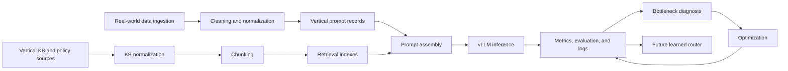

# Project Handover Source Pack

## Project Identity

- Project name: LLM Inference Optimization Suite.
- Repository purpose: a reproducible benchmark suite for measuring and explaining LLM inference optimization behavior across workloads, backends, serving modes, metrics, reports, and curated artifacts.
- Main branch workflow: continue from `main`; make scoped changes; run the repository verification commands; commit and push to `origin main` only when the checks pass.
- Professional positioning: employer-facing AI inference engineering benchmark suite focused on practical serving metrics, reproducible artifacts, and clear bottleneck analysis rather than unsupported performance claims.

## Current Phase

Phase 1 is complete or nearly complete as an inference benchmark foundation. It established synthetic inference benchmarking, a deterministic mock runner, a Hugging Face baseline, vLLM serving through an OpenAI-compatible endpoint, concurrency sweeps, chunking, checkpointing, progress logs, artifact promotion, plots, and Phase 1 reporting.

Phase 2 is planned around real-world data, vertical knowledge base sources, RAG experiments, groundedness evaluation, correctness scoring, better hardware and serving logs, and future learned router support.

## Repository Structure

| path | role |
| --- | --- |
| `src/inference_bench` | Package source for schemas, config loading, workload loading, runners, metrics, reporting, system metadata, structured-output scoring, and the Typer CLI. |
| `configs` | YAML model, workload, experiment, stress-plan, scaled-workload, and vLLM baseline definitions. |
| `data/prompts` | Committed small JSONL prompt workloads for smoke, structured output, short chat, code helpdesk, long context, and shared-prefix testing. |
| `results/samples` | Reviewed, committed sample artifacts: raw samples, processed comparison CSVs, figures, progress logs, and checkpoints. |
| `docs` | Project scope, reproducibility, methodology, vLLM plans, experiment logs, Phase 1 inventory, Phase 1 report, and Phase 2 planning context. |
| `scripts` | Local and Linux workflow scripts for Hugging Face runs, vLLM clients, scaled workload generation, sample promotion, optional dependency setup, and public-content audit. |
| `tests` | Unit and documentation tests covering configs, schemas, runners, reporting, plots, resumable execution, sample policy, scripts, and public-content checks. |

`data/eval` is not present in the committed repository at this handover point.

## Implemented CLI Commands

| command | purpose |
| --- | --- |
| `inference-bench version` | Print the installed package version. |
| `inference-bench doctor` | Run a lightweight importable-harness and environment sanity check without requiring GPU. |
| `inference-bench system-info` | Capture platform, Python, optional Torch/CUDA, and related system metadata as JSON. |
| `inference-bench validate-config` | Validate model, workload, and experiment YAML files. |
| `inference-bench generate-workloads` | Generate deterministic synthetic scaled workload JSONL files from committed templates. |
| `inference-bench mock-run` | Run the deterministic mock benchmark pipeline and write benchmark CSV rows. |
| `inference-bench hf-run` | Run local Hugging Face inference, with optional streaming TTFT and JSONL generation traces. |
| `inference-bench openai-compatible-run` | Run a single-request style benchmark against an OpenAI-compatible endpoint such as vLLM. |
| `inference-bench openai-load-run` | Run concurrent OpenAI-compatible requests with optional metadata, chunking, checkpointing, resume, and logs. |
| `inference-bench report-summary` | Summarize one benchmark CSV with counts, averages, percentiles, and cost total where available. |
| `inference-bench score-structured-jsonl` | Score generated JSONL traces for JSON validity and required structured-output fields. |
| `inference-bench compare-results` | Compare multiple benchmark CSVs into one summary table and processed comparison CSV. |
| `inference-bench make-plots` | Generate basic latency, throughput, and cost plots from one benchmark CSV. |
| `inference-bench make-phase1-plots` | Generate report-ready Phase 1 plots from the curated 5,000-prompt comparison artifact. |
| `inference-bench explain` | Print short explanations for selected inference concepts such as KV cache and prefill/decode. |

There is no `evaluate-generations` command in the current CLI. The implemented generation-evaluation command is `score-structured-jsonl`.

## Implemented Runners

- Mock runner: deterministic local runner for validating schemas, workload loading, metric calculation, CSV output, CLI wiring, and CI-safe regression checks without model downloads or GPU.
- Hugging Face runner: local Transformers-based runner for `Qwen/Qwen2.5-0.5B-Instruct` and other configured models where the `hf` extra is installed; supports optional streaming TTFT measurement and generation JSONL traces.
- OpenAI-compatible runner: client for vLLM or another OpenAI-compatible endpoint; records TTFT, TPOT, end-to-end latency, throughput, success/failure, and optional generation traces.
- Async load runner: concurrent OpenAI-compatible runner for serving tests; records per-request metrics and run-level aggregate throughput metadata.
- Chunked/resumable support: `openai-load-run` can flush CSV and JSONL outputs by chunk, write checkpoints, append progress logs, resume completed prompt IDs, and update metadata after chunks.

## Implemented Workloads

| workload | what it measures |
| --- | --- |
| `smoke` | Minimal pipeline validation for basic chat/helpdesk/shared-prefix prompt handling. |
| `structured_output_smoke` | Small JSON-format workload for parseability and required-field validation. |
| `short_chat` | Short professional writing, summarization, rewrite, confirmation, and explanation tasks; useful for low-latency assistant interactions. |
| `code_helpdesk` | Developer support, debugging, Git, CLI, dependency, environment, and troubleshooting tasks; useful for longer technical responses and truncation review. |
| `long_context` | Moderate-length passages with summarization or extraction requests; useful for TTFT, prefill, and tail-latency behavior. |
| `shared_prefix` | Repeated internal IT-support instruction prefix with varied requests; useful for future prefix-caching and policy-aware response tests. |
| Scaled generators | `inference-bench generate-workloads` can produce deterministic `short_chat`, `code_helpdesk`, `long_context`, `shared_prefix`, and `structured_output` prompt files at selected counts and seeds. |

## Implemented Metrics

| metric | definition |
| --- | --- |
| TTFT | Time to first generated token or first non-empty streamed text chunk; used to isolate prefill, queueing, warmup, and first-token latency. |
| TPOT | Time per output token after generation begins; used to isolate decode-path behavior. |
| End-to-end latency | Total request duration from request start to completion. |
| Throughput tokens/sec | Per-request token throughput over the measured request window. |
| Aggregate requests/sec | Completed requests divided by wall-clock run time for concurrent runs. |
| Aggregate output tokens/sec | Total output tokens divided by wall-clock run time for concurrent runs. |
| p50/p95/p99 | Percentiles reported by summary/comparison utilities for latency, TTFT, TPOT, and throughput where values are present; p90 is also supported internally. |
| Success/failure count | Number of result rows that completed successfully versus rows with recorded failure. |
| Input/output tokens | Input and generated token counts stored in benchmark result rows. |
| Estimated cost | Cost field in result rows and total estimated cost in summaries; current local/sample runs generally use zero-cost placeholders. |
| Peak memory | Schema field for memory measurement; current Phase 1 rows do not yet integrate serious GPU memory profiling. |

## Phase 1 Experiments Completed

Source of truth: `docs/19_phase1_experiment_inventory.md`, `docs/20_phase1_project_report.md`, and committed curated artifacts under `results/samples`.

- Hugging Face baseline: local `Qwen/Qwen2.5-0.5B-Instruct` smoke, structured-output, and expanded workload samples validate real-model execution, TTFT/TPOT capture, JSONL generation traces, summaries, and plots.
- vLLM smoke: RunPod/L40S vLLM OpenAI-compatible smoke artifacts validate server/client integration through `openai-compatible-run`.
- 1,000-prompt concurrency experiments: vLLM synthetic workload sweeps at concurrency 1, 4, 8, 16, and 32 are represented by raw samples, processed comparisons, logs, checkpoints, and metadata.
- Chunked/resumable long-context run: long-context 1,000-prompt concurrency 32 samples represent chunked result flushing, checkpoint writing, progress logging, and resume-oriented mechanics.
- 5,000-prompt Qwen 0.5B run: five synthetic workloads across concurrency 8, 16, and 32 are represented by `results/samples/processed/vllm_qwen0_5b_all_workloads_5000_concurrency_comparison_sample.csv`.

The largest committed Phase 1 sample represents 15 configurations, 75,000 total requests, and 0 recorded failures in the curated comparison. The core artifact paths are:

- `results/samples/processed/vllm_qwen0_5b_all_workloads_5000_concurrency_comparison_sample.csv`
- `results/samples/raw/vllm_qwen0_5b_*_5000_conc*_chunked_results.csv`
- `results/samples/raw/vllm_qwen0_5b_*_5000_conc*_chunked_metadata.json`
- `results/samples/logs/vllm_qwen0_5b_*_5000_conc*_chunked.log`
- `results/samples/checkpoints/vllm_qwen0_5b_*_5000_conc*_chunked_checkpoint.json`
- `results/samples/figures/phase1/plot_manifest.json`

## Curated Artifact Inventory

Important committed sample artifacts are under `results/samples`; arbitrary raw generated outputs outside this tree should not be treated as committed source material.

Processed CSVs:

- `results/samples/processed/vllm_all_workloads_1000_conc32_comparison_sample.csv`
- `results/samples/processed/vllm_all_workloads_1000_concurrency_comparison.csv`
- `results/samples/processed/vllm_all_workloads_1000_concurrency_comparison_sample.csv`
- `results/samples/processed/vllm_code_helpdesk_1000_concurrency_comparison.csv`
- `results/samples/processed/vllm_long_context_1000_concurrency_comparison.csv`
- `results/samples/processed/vllm_long_context_1000_concurrency_comparison_sample.csv`
- `results/samples/processed/vllm_qwen0_5b_all_workloads_5000_concurrency_comparison_sample.csv`
- `results/samples/processed/vllm_shared_prefix_1000_concurrency_comparison.csv`
- `results/samples/processed/vllm_short_chat_1000_concurrency_comparison.csv`
- `results/samples/processed/vllm_structured_output_1000_concurrency_comparison.csv`

Raw 5,000-prompt artifacts:

- `results/samples/raw/vllm_qwen0_5b_code_helpdesk_5000_conc{8,16,32}_chunked_results.csv`
- `results/samples/raw/vllm_qwen0_5b_code_helpdesk_5000_conc{8,16,32}_chunked_metadata.json`
- `results/samples/raw/vllm_qwen0_5b_long_context_5000_conc{8,16,32}_chunked_results.csv`
- `results/samples/raw/vllm_qwen0_5b_long_context_5000_conc{8,16,32}_chunked_metadata.json`
- `results/samples/raw/vllm_qwen0_5b_shared_prefix_5000_conc{8,16,32}_chunked_results.csv`
- `results/samples/raw/vllm_qwen0_5b_shared_prefix_5000_conc{8,16,32}_chunked_metadata.json`
- `results/samples/raw/vllm_qwen0_5b_short_chat_5000_conc{8,16,32}_chunked_results.csv`
- `results/samples/raw/vllm_qwen0_5b_short_chat_5000_conc{8,16,32}_chunked_metadata.json`
- `results/samples/raw/vllm_qwen0_5b_structured_output_5000_conc{8,16,32}_chunked_results.csv`
- `results/samples/raw/vllm_qwen0_5b_structured_output_5000_conc{8,16,32}_chunked_metadata.json`

Figures, logs, and checkpoints:

- `results/samples/figures/phase1/*.png`
- `results/samples/figures/phase1/plot_manifest.json`
- `results/samples/logs/vllm_*_1000_conc*_chunked.log`
- `results/samples/logs/vllm_qwen0_5b_*_5000_conc*_chunked.log`
- `results/samples/checkpoints/vllm_*_1000_conc*_chunked_checkpoint.json`
- `results/samples/checkpoints/vllm_qwen0_5b_*_5000_conc*_chunked_checkpoint.json`

## Phase 1 Key Findings

- vLLM successfully served local OpenAI-compatible inference from the project client workflow.
- Increasing concurrency increased aggregate throughput in the curated samples, but also increased TTFT, p95/p99 latency, and other tail-latency pressure.
- Chunking, checkpoints, metadata, and progress logs are necessary for long GPU runs because interrupted runs can otherwise lose useful outputs.
- Synthetic workloads are useful for stress, reproducibility, and controlled bottleneck analysis, but they are not enough for real-world validity.
- Correctness and groundedness evaluation must be added before making larger model-scale or optimization claims.
- Hardware and serving logs need improvement before the project can support serious inference benchmarking across model sizes and serving configurations.

## Dissertation Linkage

The dissertation work focused on routing under a fixed BM25-RAG setup. This project doubles down on inference serving and optimization by building the benchmark harness, vLLM serving path, concurrency measurement, artifacts, and reporting needed to measure serving bottlenecks directly.

Phase 2 should address limitations related to fixed BM25 retrieval, small gold sets, deterministic scorer saturation, domain specificity, retrieval misses, structured-output fragility, infrastructure variability, and future learned routing. The dissertation text itself is not copied into this repository document.

## Phase 2 Revised Direction

- Validate candidate data sources before implementation.
- Use real-world data as the prompt source where licensing and public-use constraints are acceptable.
- Clean and normalize data before prompt construction.
- Build vertical knowledge base and policy sources before implementing RAG pipelines.
- Implement RAG modes in stages: `no_context`, `bm25`, `dense`, `hybrid`, then reranked and compressed variants.
- Build per-vertical gold sets for deterministic correctness checks.
- Add groundedness scoring tied to retrieved context and expected evidence.
- Improve hardware, runtime, vLLM, request, and serving logs.
- Design schemas that can support future learned router experiments without forcing that implementation into Phase 2.

## Candidate Phase 2 Verticals

These are candidates pending source validation, license review, schema fit, and benchmark usefulness. They are not final dataset decisions.

| vertical | candidate prompt source | candidate KB source | expected benchmark task | expected correctness checks | local vs GPU notes |
| --- | --- | --- | --- | --- | --- |
| Airline customer support | Candidate public airline-support or travel-service records, pending validation. | Candidate public policy, baggage, refund, delay, and loyalty guidance sources, pending validation. | Answer customer service questions with or without retrieved policy context. | Policy-grounded answer selection, refusal/escalation rules, and citation/evidence checks. | Validate schemas and retrieval locally; run scaled vLLM inference on RunPod. |
| Retail/e-commerce support | Candidate public retail-support or product-service records, pending validation. | Candidate return, shipping, warranty, account, and product policy sources, pending validation. | Resolve order, return, shipping, and product-support questions. | Correct policy application, groundedness to retrieved policy, and structured outcome labels. | Local for cleaning, BM25, dense retrieval, and smoke tests; RunPod for large sweeps. |
| Developer/code helpdesk | Candidate public issue, support, or troubleshooting prompt records, pending validation. | Candidate documentation, FAQ, troubleshooting, and command-reference sources, pending validation. | Provide grounded debugging or operational help using docs. | Command relevance, doc citation/evidence, and safe troubleshooting sequence checks. | Local for fixtures and retrieval; GPU for larger model and concurrency runs. |
| Finance/insurance document QA | Candidate public finance or insurance QA/document records, pending validation. | Candidate public policy, disclosure, plan, or claims-process documents, pending validation. | Answer document-grounded questions from policy-like sources. | Evidence match, conservative answer handling, and no-context refusal where evidence is missing. | Keep source validation local; run GPU only after gold-set and audit checks are stable. |
| Enterprise IT support | Candidate public IT helpdesk or synthetic company-support records, pending validation. | Candidate public or synthetic IT policy, SSO, VPN, device, and security guidance sources, pending validation. | Answer internal support questions with policy-aware context. | Escalation correctness, sensitive-data avoidance, policy grounding, and structured ticket labels. | Local mock/HF smoke tests first; RunPod for vLLM scale and multi-model sweeps. |

## Updated Phase 2 Architecture



## Local vs RunPod Work Split

| work item | default location |
| --- | --- |
| Data source validation | Local |
| Schema/docs | Local |
| KB fixtures | Local |
| RAG retriever implementation | Local |
| Correctness/groundedness evaluation | Local |
| Small smoke tests | Local/mock/HF |
| Large vLLM inference | RunPod |
| Multi-model sweeps | RunPod |
| Plotting/reporting | Local |
| Hardware logs | RunPod during experiments |

## Immediate Next Actions

1. Create data-source validation matrix.
2. Create KB/policy strategy.
3. Create Phase 2 architecture/design document.
4. Implement vertical schema and KB fixtures.
5. Implement BM25 retriever.
6. Implement dense/hybrid retrieval.
7. Implement RAG prompt assembler.
8. Implement groundedness/correctness evaluation.
9. Run local RAG smoke tests.
10. Return to RunPod for scaled RAG benchmark.

## Open Questions

- Which exact dataset should be used per vertical?
- Which licenses are acceptable for committed fixtures, derived prompts, and reported results?
- How many gold examples are needed per vertical?
- Should Phase 2 use public policies, synthetic company policies, or both?
- Should LLM-as-judge be included later, and under what audit constraints?
- When should learned routing be added?
- Whether and when fine-tuning is justified.

## Verification Snapshot

Latest known test count from this handover update: `155 passed` from `pytest`.

The required verification sequence is:

```text
ruff format .
ruff check .
ruff format --check .
mypy src tests
pytest
python scripts/audit_repo_public_content.py
inference-bench doctor
inference-bench validate-config
git status
```

Future assistants should keep these checks passing before committing changes.
