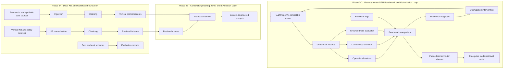

# Phase 2 Master Plan

## Purpose

Phase 2 moves the project from synthetic inference stress tests to real-world and
realistic enterprise vertical benchmarks. The focus expands from serving metrics
alone to data strategy, knowledge bases, context engineering, RAG, correctness,
groundedness, memory-aware inference, and future routing.

Phase 1 proved the benchmark harness: synthetic workloads, Hugging Face baseline
execution, vLLM/OpenAI-compatible serving, concurrency and load testing, chunked
runs, checkpoints, logs, curated artifacts, reports, and plots. Phase 2 makes the
benchmark more realistic and enterprise-relevant by measuring how serving choices
interact with data quality, context quality, evidence requirements, and vertical
risk.

## Phase 2 Structure

### Phase 2A - Data, KB, and Gold/Eval Foundation

Default location: local VS Code only.

Goal: make benchmark data real, auditable, and vertical-specific before RAG or GPU
experiments.

Outputs:

- Data source validation matrix.
- Source registry.
- Vertical KB registries.
- Small committed samples.
- Gold/eval schema.
- Per-vertical prompt generation plan.

Hard rule: no large RAG implementation and no GPU spend until every vertical has:

1. Data/source strategy.
2. KB/policy strategy.
3. Gold/eval strategy.

### Phase 2B - Context Engineering, RAG, and Evaluation Layer

Default location: local VS Code first.

Goal: build retrieval, context assembly, prompt construction, correctness
evaluation, and groundedness evaluation.

Outputs:

- KB normalization.
- Chunking.
- Retrieval modes.
- Context engineering layer.
- Prompt assembly.
- Correctness evaluator.
- Groundedness evaluator.

### Phase 2C - Memory-Aware GPU Benchmark and Optimization Loop

Default location: RunPod for inference, local VS Code for analysis.

Goal: run vLLM/RAG inference under load and optimize based on measured bottlenecks.

Outputs:

- Hardware telemetry.
- vLLM serving logs.
- Memory diagnostics.
- Prefix caching experiment.
- Context-length sweep.
- RAG top-k/context-token sweep.
- Model-size comparison.
- Quantization comparison.
- Backend comparison.
- Before/after optimization report.
- Future learned-router dataset.

## Phase 2 Architecture Diagram

## Approved Phase 2A Rule

No large RAG implementation and no GPU spend until data, KB, and gold/eval design
are available for each vertical.

## Vertical 1: Finance / Insurance Document QA

Dataset recommendation:

- Primary: SEC EDGAR filings and XBRL company facts.
- Secondary/seed: DocFinQA/FinQA-style financial QA if useful later.

Scenario: NorthBridge Equity Research AI Desk covering public tech stocks.

Companies: NVDA, MSFT, AAPL, AMZN, GOOGL, META, TSLA, AMD.

Documents:

- 2 latest 10-Ks per company.
- 4 latest 10-Qs per company.
- 2 latest earnings 8-Ks per company.
- Optional investor presentation.
- XBRL company facts.

KB:

- SEC filings.
- Filing sections.
- Extracted financial tables.
- XBRL facts.
- Document registry.
- Filing metadata.

Evaluation/gold:

- XBRL facts for numeric answers.
- Filing evidence spans for text answers.
- Required document IDs.
- Citation checks.
- Calculation formulas.
- 100 escalation/insufficient-evidence prompts out of 10,000.

Output types:

- Short factual answer.
- Long analytical answer.
- Calculation answer.
- JSON extraction.
- Markdown table.
- Comparison memo.
- Risk summary.
- Trend summary.
- Citation-grounded answer.
- Escalation response.

## Vertical 2: Airline Customer Support

Dataset recommendation: synthetic Canada Air global support tickets from January
2024 to June 30, 2026.

Fields:

- `airline`
- `travel_type`
- `support_type`
- `route`
- `partner_airline_involved`
- `issue`
- `required_policy_ids`
- `resolution_steps`
- `final_answer`
- `expected_status`
- `escalation_reason`
- `spam_or_fraud`

Travel types:

- Domestic Canada.
- Regional US/Mexico.
- International.

KB: public-inspired and synthetic airline policy corpus covering:

- Ticket purchase.
- 24-hour cancellation.
- Refunds.
- Ticket changes.
- Missed flights/no-show.
- Same-day change.
- Standby.
- Baggage allowance.
- Delayed/lost/damaged baggage.
- Travel credits.
- Partner airlines.
- Codeshare responsibility.
- Visa/passport documentation.
- Accessibility support.
- Weather disruption.
- Crew/operational cancellation.
- Medical emergency exception.
- Loyalty points.
- Chargeback/fraud policy.

Evaluation/gold:

- 90% answerable.
- 8% escalation.
- 2% spam/fraud/ignore.

Escalation split:

- 70% account/payment/identity/manual booking access required.
- 30% partner airline/irregular operations/compensation edge case requiring human
  review.

Output types:

- Short support response.
- Structured classification.
- Grounded RAG answer.
- Policy citation.
- Escalation/action recommendation.

## Vertical 3: Retail / E-commerce Support

Dataset recommendation: McAuley-Lab/Amazon-Reviews-2023 and metadata.

Start:

- All_Beauty category first.
- Expand after exploration.
- Use the last 18 months available after timestamp validation.

KB:

- Product metadata.
- Title.
- Features.
- Description.
- Details.
- Category.
- Price if available.
- Average rating if available.
- Review summaries.
- Common complaints.
- Synthetic return/warranty/shipping policy.

Evaluation/gold:

- Metadata facts.
- Review facts.
- Product category.
- Sentiment/issue labels.
- Required product IDs.
- Support action labels.

Stratification:

- 90% answerable.
- 8% escalation.
- 2% spam/fraud/irrelevant.

Output types:

- Product support answer.
- Structured issue classification.
- Grounded product answer.
- Product attribute extraction.
- Review summary.
- Action recommendation.

## Vertical 4: AI Research Assistant / Education-Research

Dataset recommendation: use real research papers rather than Stack Overflow or
BigQuery. Those sources are deliberately not selected for this Phase 2 vertical.

Corpus topics:

- AI inference optimization.
- Reinforcement learning.
- LLMs / agentic systems.

Target:

- 30 papers per topic for v1.
- 90 papers total.
- v2 may expand to 120+ papers.

Sources:

- arXiv PDFs/HTML where available.
- Optional metadata enrichment from Semantic Scholar and OpenAlex.
- User may manually add relevant PDFs to the repo or local data directory.

Scenario: a research institute has an AI research assistant for scientists studying
AI inference, reinforcement learning, and LLM/agentic systems.

The assistant helps researchers:

- Summarize papers.
- Compare methods.
- Extract experimental setup.
- Identify limitations.
- Explain equations/concepts.
- Find evidence across papers.
- Generate structured literature-review tables.
- Decide whether a question is answerable from the paper corpus.

KB: the research paper corpus becomes the knowledge base.

Parse papers into sections:

- Abstract.
- Introduction.
- Method.
- System architecture.
- Experiments.
- Results.
- Limitations.
- Related work.
- Conclusion.
- Tables/captions where extractable.

Chunking:

- Section-aware chunks.
- Recursive paragraph chunks.
- Preserve `paper_id`, `section`, `title`, `topic`, and citation metadata.

Prompt/output families:

- `answer_short`
- `answer_grounded`
- `long_context_analysis`
- `compare_papers`
- `extract_structured`
- `literature_table`
- `method_classification`
- `limitation_extraction`
- `research_gap_identification`
- `escalation_response`

Gold/eval:

- 10,000 prompts available.
- 1,000 deterministic gold records.
- 300 deep-reviewed records.

Gold fields:

- `required_paper_ids`
- `required_chunk_ids`
- `required_citations`
- `must_include`
- `must_not_include`
- `expected_escalation`
- `topic`
- `task_type`

Escalation reasons:

- `insufficient_corpus_evidence`
- `requires_expert_research_judgment`

## Vertical 5: Healthcare Administrative Support

Dataset recommendation: use synthetic healthcare administrative support tickets,
not clinical diagnosis data. This vertical simulates a non-clinical administrative
support desk.

Scenario: MapleCare Administrative Services or NorthBridge Health Administrative
Support Desk.

Time window: January 2024 to June 30, 2026.

Target: 10,000 prompts.

Support classes:

- `appointment_booking`
- `appointment_reschedule`
- `appointment_cancellation`
- `referral_status`
- `insurance_verification`
- `billing_question`
- `payment_plan_request`
- `medical_records_request`
- `portal_access`
- `telehealth_setup`
- `provider_schedule_change`
- `prior_authorization_status`
- `prescription_refill_routing`
- `lab_result_availability`
- `transportation_or_accessibility_request`
- `language_interpreter_request`
- `new_patient_registration`
- `clinic_location_hours`
- `complaint_or_grievance`
- `privacy_request`

KB: synthetic public-inspired administrative healthcare policy documents:

- Appointment scheduling policy.
- No-show/cancellation policy.
- Referral processing policy.
- Insurance verification policy.
- Billing/payment plan policy.
- Medical records release policy.
- Portal access policy.
- Telehealth setup guide.
- Prior authorization workflow.
- Prescription refill routing policy.
- Lab result notification policy.
- Patient privacy policy.
- Interpreter/accessibility policy.
- Complaints/grievances policy.
- Emergency boundary policy.

Stratification:

- 88% answerable administrative support.
- 8% escalation.
- 2% urgent clinical/safety boundary.
- 2% spam/fraud/irrelevant.

Escalation reasons:

- `identity_or_privacy_verification_required`
- `payer_or_provider_manual_review_required`

Safety boundary: the assistant must not diagnose, interpret lab results, or give
medical advice. It should redirect urgent symptoms to appropriate clinical or
emergency channels.

Output families:

- `answer_short`
- `answer_grounded`
- `extract_structured`
- `classification_routing`
- `recommend_action`
- `escalation_response`
- `boundary_response`

Gold/eval:

- 10,000 prompts available.
- 1,000 deterministic gold records.
- 300 deep-reviewed records.

Gold fields:

- `expected_queue`
- `required_policy_ids`
- `must_include`
- `must_not_include`
- `expected_status`
- `expected_escalation`
- `safety_boundary`
- `privacy_sensitive`

## Output Families

Benchmark output families:

- `classify`
- `answer_short`
- `answer_grounded`
- `extract_structured`
- `recommend_action`
- `long_context_analysis`
- `calculation_answer` where applicable.
- `escalation_response`
- `boundary_response` where applicable.
- `literature_table` where applicable.
- `compare_papers` where applicable.

Each vertical supports multiple output types. Phase 2 should not reduce a vertical
to one response format, because serving pressure, correctness checks, context
needs, and risk differ by task family.

## RAG Modes

Phase 2 target modes:

- `no_context`
- `bm25`
- `dense`
- `hybrid`
- `reranked_hybrid`
- `contextual_compression`

Implementation order:

1. `no_context` + `bm25`
2. `dense`
3. `hybrid`
4. `reranked_hybrid`
5. `contextual_compression`

## Chunking Strategy

- Airline: section-aware policy chunks plus recursive paragraphs.
- Retail: product-level parent records plus review snippets.
- AI research: paper section-aware chunks plus recursive paragraph chunks.
- Finance: filing sections, tables, and section-aware chunks.
- Healthcare admin: policy/procedure sections with overlap.

## Context Engineering Layer

Context engineering includes:

- Cleaning.
- Normalization.
- KB construction.
- Chunking.
- Retrieval.
- Reranking.
- Compression.
- Prompt assembly.
- Context budgeting.
- Citation requirements.
- Schema formatting.

Context engineering is the layer between raw data/KB and inference. It controls
what the model sees, how much it sees, and how that affects TTFT, TPOT, cost, KV
cache pressure, and correctness.

## Evaluation Strategy

Each vertical needs a gold/eval layer before scaled inference.

Gold records should include:

- `prompt_id`
- `vertical`
- `task_type`
- `reference_answer`
- `expected_category`
- `required_doc_ids`
- `required_chunk_ids` when applicable.
- `must_include`
- `must_not_include`
- `required_citations`
- `expected_escalation`
- `risk_level`

Initial target:

- 10,000 prompts per vertical available.

Minimum gold sample:

- 1,000 deterministic gold records per vertical.

Deep-reviewed sample:

- 300 per vertical.

## Memory-Aware Inference Strategy

Lessons from inference optimization:

- High TTFT points to a prefill/context bottleneck.
- High TPOT points to a decode bottleneck.
- Throughput collapse points to a scheduling/batching bottleneck.
- Memory pressure often comes from KV cache, context length, model size, and
  concurrency.

Future experiments:

- Hardware telemetry.
- Prefix caching.
- Context-length sweep.
- RAG top-k/context-token sweep.
- Model-size comparison.
- Quantization comparison.
- Backend comparison.
- Speculative decoding if TPOT is the bottleneck.
- Tensor parallel comparison later for large models.

## Future Learned Router Goal

All benchmark outputs should eventually feed a learned enterprise router that
selects:

- Model.
- Retrieval mode.
- Context size.
- Escalation path.
- Serving configuration.

The learned router should eventually use:

- Query complexity.
- Vertical.
- Risk level.
- Retrieval confidence.
- Context token estimate.
- Model latency history.
- Model quality history.
- Current traffic pressure.
- Cost budget.
- SLA class.

## Local vs RunPod Split

| work item | default location |
| --- | --- |
| Data validation | Local |
| Source registry | Local |
| KB fixtures | Local |
| Gold/eval samples | Local |
| Retrieval implementation | Local |
| Small smoke tests | Local |
| Large vLLM inference | RunPod |
| Hardware telemetry | RunPod |
| Plots/reporting | Local |
| Model sweeps | RunPod |

## Immediate Next Actions

1. Create data-source validation matrix.
2. Implement finance SEC acquisition pilot.
3. Implement retail Amazon Reviews exploration pilot.
4. Implement airline synthetic policy/ticket schema.
5. Implement AI research paper registry and ingestion plan.
6. Implement healthcare administrative synthetic schema.
7. Create KB registry schema.
8. Create gold/eval schema.
9. Create small committed samples for each vertical.
10. Only then move to chunking and retrieval.
