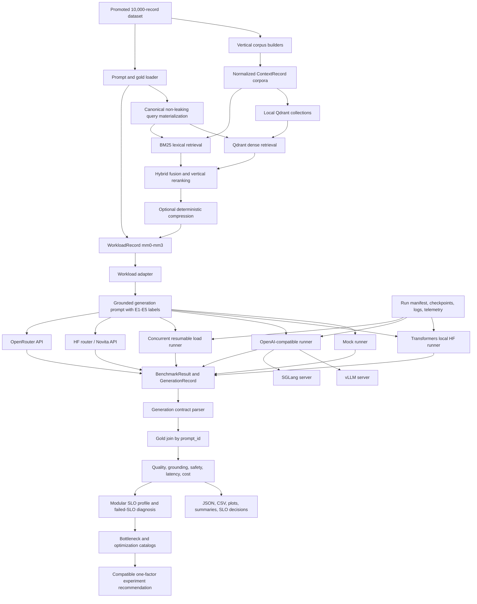

# Definitive Technical Briefing

Status: authoritative repository reference as of June 16, 2026

Repository: `LLM-Inference-Optimization-Suite`

This document explains the current system, the historical systems retained for
auditability, and the planned work that has not yet been implemented. It is
intended to be permanent project context for engineers and AI assistants that
have not previously seen the repository.

## How To Read This Document

The repository contains several generations of architecture and experiment
documentation. This briefing uses the following evidence order:

1. Current source code and checked-in configuration.
2. Current promoted manifests and generated source-of-truth reports.
3. Current tests.
4. Curated result samples tied to documented commands.
5. Historical plans and reports.

Labels used throughout:

- **Implemented**: present in executable source and covered by tests.
- **Validated**: implemented and exercised by a recorded local, API, or curated
  benchmark run.
- **Historical**: preserved to explain an earlier architecture or result, but
  not the current source of truth.
- **Planned**: described in configuration or documentation but not yet
  implemented or measured.

There is no checked-in `AGENTS.md`. Repository-specific operating rules are
therefore derived from the README, project configuration, tests, and docs.

# 1. Project Overview

## What The Project Is

The LLM Inference Optimization Suite is a reproducible engineering system for
measuring and improving the path from a workload record to a grounded model
response. It combines:

- versioned model and backend configuration;
- real and synthetic benchmark data;
- vertical-specific knowledge corpora;
- Qdrant-backed hybrid retrieval;
- deterministic context compression;
- grounded structured generation contracts;
- local, API, and OpenAI-compatible inference runners;
- request-level latency, throughput, quality, and cost metrics;
- resumable execution and artifact promotion;
- production-style service-level objectives.

It is not primarily a model-comparison project. Models and backends are
experimental variables inside a larger inference system. The central question
is how serving architecture, retrieval, context, memory mode, scheduling,
hardware, and optimization choices affect useful work per unit time and cost
without sacrificing correctness, groundedness, safety, or reliability.

## Why It Exists

An LLM that produces a correct answer in isolation can still be unsuitable for
production because it may:

- take too long to produce the first token;
- decode too slowly;
- collapse under concurrent requests;
- use too much VRAM;
- retrieve the wrong evidence;
- exceed the context budget;
- return invalid structured output;
- omit required citations;
- cost too much per successful grounded answer;
- lose progress during a long run.

The suite turns those concerns into repeatable experiments with explicit
schemas, workload splits, metrics, SLOs, and reports.

## Engineering Problem

The engineering problem is to identify the actual bottleneck in an end-to-end
LLM system and change the appropriate layer:

- retrieval quality and final evidence selection;
- context length and ordering;
- model execution;
- prefill or decode;
- queueing and batching;
- KV-cache pressure;
- backend scheduling;
- concurrency;
- hardware utilization;
- output-contract adherence;
- evaluation and cost accounting.

Optimizing only one layer can move the bottleneck elsewhere. For example,
compression can improve prefill latency but damage evidence recall. Higher
concurrency can raise aggregate throughput while worsening TTFT and p99
latency. A faster API model can still be inferior if it under-cites required
evidence.

## Business Problem

The project supports decisions such as:

- What deployment can satisfy latency and quality SLOs?
- What does a grounded successful answer cost?
- Is self-hosting economically justified compared with an API?
- Which requests are context-heavy enough to require separate routing?
- What concurrency gives the best capacity without unacceptable tail latency?
- Which optimization reduces cost without reducing answer quality?
- When should the system answer, retry, or escalate?

The useful business unit is not simply tokens per second. It is a successful,
safe, grounded answer delivered within an acceptable latency and cost envelope.

## Meaning Of "Inference Optimization Suite"

The name refers to a suite because the project optimizes and measures multiple
coupled subsystems:

- data and workload control;
- retrieval and context construction;
- generation;
- serving runtime;
- batching and concurrency;
- hardware and memory;
- evaluation;
- cost;
- reporting and operational safety.

## Why Inference Engineering Matters

Training determines model capability. Inference engineering determines whether
that capability can be delivered predictably and economically. It covers model
loading, request scheduling, tokenization, prefill, KV-cache allocation,
decode, streaming, failure recovery, telemetry, and deployment cost.

## Questions The Project Is Designed To Answer

- How do TTFT, TPOT, end-to-end latency, and throughput change with workload
  length and concurrency?
- Does hybrid retrieval outperform a dense-only or no-context baseline?
- Does deterministic context compression reduce input work without reducing
  evidence recall?
- Do vLLM and SGLang serving paths outperform direct Transformers under
  controlled conditions?
- What quality is lost or gained when changing model size, memory mode, or
  optimization?
- Where does GPU memory go, and how much headroom remains?
- What are the API-token and self-hosted infrastructure costs?
- Does the system satisfy per-vertical SLOs?

## Definition Of Success

Success is a reproducible before-and-after optimization result where:

- the workload, model, backend, memory mode, and hardware are recorded;
- retrieval and generation quality remain at or above target;
- latency, throughput, resource, or cost metrics improve;
- tail latency and failures are reported rather than hidden;
- raw results can be resumed, evaluated, and traced to source records;
- claims are limited to measured evidence.

# 2. Current Project Architecture

## System Diagram



## Major Subsystems

### CLI

`src/inference_bench/cli.py` exposes the `inference-bench` command. Current
commands cover:

- version and environment checks;
- system metadata capture;
- config validation;
- deterministic scaled workload generation;
- mock, local HF, OpenAI-compatible, and concurrent OpenAI-compatible runs;
- summary reporting;
- structured-output scoring;
- result comparison;
- plotting and Phase 1 plot generation.

Phase-specific scripts under `scripts/phase2`, `scripts/phase3`, and
`scripts/phase4` orchestrate data curation, retrieval, readiness checks, and
smoke validations without duplicating the core runners.

### Benchmark Runner

The runner layer accepts `WorkloadItem` records and produces:

- `BenchmarkResult` rows for metrics;
- `GenerationRecord` rows for prompt/output traces and parsed contract fields.

Current runner families:

- deterministic mock;
- in-process Hugging Face Transformers;
- synchronous OpenAI-compatible;
- asynchronous concurrent OpenAI-compatible load runner.

### Model Registry

`configs/models.yaml` stores canonical model records and stable aliases.
`src/inference_bench/model_registry.py` and `config.py` resolve both canonical
keys and aliases. Deprecated aliases remain supported to avoid breaking older
configs and reports.

### Runtime Registry

`configs/runtime_engines.yaml` and `src/inference_bench/runtime_registry.py`
define the production runtime layer. The registry separates:

- Runtime: Hugging Face Transformers, vLLM, SGLang, API provider route, and
  TensorRT-LLM planned placeholder;
- Infrastructure: developer workstation, self-hosted GPU, RunPod GPU, or
  provider-managed API infrastructure;
- Tooling: runners, manifests, telemetry, pricing, checkpointing, and result
  schemas;
- Evaluation: deterministic contract, evidence, groundedness, safety, latency,
  throughput, and cost gates.

Runtime status values are `ready`, `dry_run_ready`, `planned`, and
`deprecated`. API aliases must use the API provider route with
provider-managed hardware. Open-weight aliases may use Hugging Face
Transformers, vLLM, or SGLang when both the model registry and runtime registry
allow the pairing. TensorRT-LLM is registered only as a planned engine and is
not selectable for live runs until smoke-tested.

### Production Workload Metadata

`configs/load_profiles.yaml` and `src/inference_bench/load_profiles.py` define
input sequence length buckets, output sequence length buckets, traffic
profiles, and deterministic jittered request-arrival simulation. Production
benchmark reports must include:

- input token distribution;
- output token distribution;
- traffic profile;
- concurrency;
- request arrival mode.

Registered traffic profiles are `online_low_latency`, `office_hours_bursty`,
`offline_throughput`, and `custom`.

### Prompt System

The Phase 3 `WorkloadRecord` preserves source prompt data, selected context,
retrieval metadata, and gold evidence identifiers for offline evaluation. The
Phase 4 adapter renders a runner prompt using:

- the user-visible question;
- memory mode;
- ranked evidence blocks labeled `E1`, `E2`, and so on;
- a strict five-field JSON generation contract.

### Retrieval

The current promoted retrieval architecture is:

- canonical query materialization from prompt-visible fields and allowed
  metadata;
- direct evidence-identifier scrubbing for strict modes;
- BM25 lexical retrieval;
- local embedded Qdrant vector retrieval;
- weighted hybrid fusion;
- vertical-specific metadata boosts and deterministic reranking;
- final evidence selection;
- optional deterministic compression.

### Context Engineering

Each vertical has a dedicated chunk builder. Context is normalized into the
typed `ContextRecord` schema, ranked, optionally compressed, and rendered with
stable provenance and short citation labels.

### Memory Layer

Five modes are registered:

- `mm0_no_context`;
- `mm1_dense_top5`;
- `mm2_hybrid_top5`;
- `mm3_compressed_hybrid_top5`;
- `mm4_bounded_agentic`.

mm0 through mm3 produce normal single-pass benchmark workloads. mm4 is now an
executable bounded LangGraph workflow over frozen promoted-context snapshots.
It is an experimental inference mode, not an autonomous chatbot.

### Evaluation

Evaluation joins generated output to gold by `prompt_id`. It computes format,
contract, required phrase, prohibited phrase, evidence, groundedness,
insufficient-evidence, escalation, and safety signals. Current groundedness is
deterministic evidence coverage, not semantic entailment.

The Phase B2 intelligence layer resolves modular SLO profiles, separates
passed, failed, not-applicable, and unavailable metrics, and diagnoses
bottlenecks only from failed targets. Recommendations come from deterministic
rules and structured catalogs rather than an LLM.

### Telemetry

The request telemetry schema includes timestamp, backend, model, memory mode,
latency, TTFT, TPOT, token throughput, request throughput, success, and error
type. GPU utilization, GPU memory, GPU cost, and RunPod cost are nullable future
fields.

### Reporting

The project writes:

- raw request CSV/JSONL;
- generation traces;
- run manifests;
- checkpoints and logs;
- processed evaluation and cost reports;
- comparison CSVs;
- local SLO diagnosis and optimization recommendation reports;
- static and interactive figures;
- data EDA dashboards;
- engineering decision docs and block summaries.

### Execution Targets

- Local Windows development and CPU Transformers validation.
- External API validation through OpenRouter and the Hugging Face router.
- Historical Linux/RunPod L40S vLLM calibration.
- Validated live vLLM and SGLang execution on the remote RTX 3070.
- Validated bounded LangGraph mm4 execution through the same vLLM endpoint.
- Validated Qwen2.5-1.5B vLLM loading and 100-prompt quality-gated execution on
  the remote RTX 3070.

A checked-in remote RTX 3070 development profile and frozen A1 vLLM smoke
matrix now exist. The 50-prompt A1 run validated the current live remote GPU
path; it is a small-model serving result, not a full-scale benchmark.

# 3. Inference Pipeline

## Stage 1: Dataset Selection

Purpose: choose a deterministic split and preserve traceability.

Inputs:

- promoted prompt JSONL;
- matching gold JSONL;
- selected split: `smoke_500`, `controlled_2000`, or `final_10000`;
- selected memory mode and ablation mode.

Outputs:

- selected prompt records;
- deterministic prompt IDs and vertical distribution.

Metrics:

- record counts;
- per-vertical counts;
- prompt/gold alignment.

Current implementation:

- `memory_workloads.select_prompts_for_split`;
- 100 prompts per vertical for `smoke_500`;
- 400 per vertical for `controlled_2000`;
- all 2,000 per vertical for `final_10000`.

Future improvement: explicit train/development/test isolation if model or
reranker learning is introduced. The current project is inference evaluation,
not model training.

## Stage 2: Prompt And Query Construction

Purpose: separate the user-visible generation question from the retrieval query.

Inputs:

- source prompt record;
- vertical;
- ablation mode;
- allowed prompt metadata.

Outputs:

- normalized prompt;
- canonical retrieval keys;
- enriched query;
- expansion types;
- leakage diagnostics.

Metrics:

- rewrite count;
- blocked direct-hint count;
- whether metadata or source hints were used.

Current implementation:

- `retrieval_keys.py`;
- `canonical_queries.py`;
- `memory_workloads.prompt_query_text`;
- three ablations: `prompt_text_only`, `prompt_plus_metadata`, and
  `prompt_plus_source_hints`.

The promoted source of truth uses `prompt_plus_metadata`. Source-hint mode is
retained as an assisted upper bound and is not canonical.

## Stage 3: Retrieval

Purpose: select evidence likely to answer the prompt.

Inputs:

- canonical query;
- vertical context corpus;
- memory mode;
- Qdrant and lexical indexes.

Outputs:

- candidate contexts;
- component scores;
- final ranked top five;
- retrieval latency and diagnostics.

Metrics:

- candidate recall@20 and @50;
- final recall@5;
- MRR;
- retrieval latency;
- backend and vector-store labels.

Current implementation:

- BM25;
- Qdrant vector retrieval;
- hybrid score fusion;
- vertical-specific boosts and selectors.

Future improvement:

- replace hashing embeddings with a controlled semantic embedding model;
- compare rerankers without changing the promoted evaluation contract;
- record backend-native queue and cache telemetry.

## Stage 4: Context Compression And Ordering

Purpose: reduce prompt tokens while preserving useful evidence.

Inputs:

- ranked retrieval results;
- memory-mode token budget.

Outputs:

- deduplicated, compressed, score-ordered context records;
- compression metadata.

Metrics:

- original and compressed context tokens;
- token-reduction percentage;
- recall before and after compression;
- gold evidence retained.

Current implementation:

- exact normalized-text deduplication;
- score thresholding;
- deterministic head/tail extractive truncation;
- hard token budget;
- at least one retained context when retrieval succeeded.

## Stage 5: Runner Prompt Rendering

Purpose: produce one backend-neutral prompt.

Inputs:

- user-visible question;
- memory mode;
- selected `ContextRecord` objects.

Outputs:

- `WorkloadItem`;
- evidence labels and alias map;
- strict output instructions.

Metrics:

- context count and token estimate;
- prompt input-token count once tokenized.

Current implementation:

- `workload_adapter.py`;
- `generation_contract.py`.

## Stage 6: Tokenization

Purpose: map prompt text to model tokens.

Inputs: rendered prompt and backend tokenizer.

Outputs: token IDs and input-token count.

Metrics: input tokens, output tokens, total tokens.

Current implementation:

- local HF uses the model tokenizer;
- OpenAI-compatible/API routes use provider usage when available;
- fallbacks are clearly distinguished from provider counts.

Future improvement: standardize tokenizer provenance in every run manifest and
record context-window utilization.

## Stage 7: Prefill

Purpose: process the input sequence and initialize attention/KV state.

Inputs: input token IDs.

Outputs: first-token logits and KV-cache state.

Metrics:

- TTFT, which includes client/server overhead, queueing, tokenization where
  applicable, and prefill;
- future backend-native prefill time;
- future prefill tokens per second.

Current implementation: TTFT is available for streaming HF/API/OpenAI-compatible
paths. The project does not yet disaggregate queue time, network time, and GPU
prefill kernels.

## Stage 8: Decode

Purpose: generate output tokens autoregressively.

Inputs: KV state, sampling/generation settings.

Outputs: output tokens and final text.

Metrics:

- TPOT;
- ITL distribution for streaming APIs;
- output tokens per second;
- end-to-end latency.

Current implementation: HF and OpenAI-compatible runners capture TPOT and token
throughput where timing data permits. Streaming API validation captures ITL
p50/p95/p99.

## Stage 9: Streaming

Purpose: expose first-token and inter-token behavior rather than only total
latency.

Inputs: streaming response chunks.

Outputs: assembled text and timing samples.

Metrics: TTFT, per-token arrival intervals, ITL percentiles, TPOT, E2E.

Current implementation:

- local HF has an optional `TextIteratorStreamer` path;
- OpenAI-compatible runners support streaming;
- OpenRouter and HF router smoke paths have recorded streaming measurements.

Configuration debt: `configs/backend_matrix.yaml` currently says local HF does
not support streaming or TTFT, while the runner implementation does. The code
is more capable than the matrix and the matrix should be corrected before the
next formal readiness report.

## Stage 10: Contract Parsing

Purpose: convert model text into evaluator-friendly structured output.

Inputs: generated text and allowed `E1`-style labels.

Outputs:

- parsed answer;
- evidence IDs;
- confidence;
- insufficient-evidence flag;
- citation notes;
- validity and parse diagnostics.

Metrics: JSON validity, contract validity, truncation, repair applied, invalid
evidence labels.

## Stage 11: Evaluation

Purpose: score output against the benchmark contract.

Inputs:

- generation row;
- gold record joined by `prompt_id`;
- citation alias mapping.

Outputs:

- status and format correctness;
- evidence presence and full match;
- deterministic groundedness;
- safety and prohibited-term findings.

Metrics are aggregated by model, backend, memory mode, vertical, and run.

## Stage 12: Reporting And Promotion

Purpose: preserve measured evidence without treating every local artifact as a
final public result.

Inputs: raw result rows, generations, manifests, checkpoints, evaluations.

Outputs:

- raw and processed artifacts;
- curated samples;
- plots;
- comparison reports;
- SLO decisions.

Current policy: full raw outputs remain ignored. Only reviewed, non-sensitive,
small artifacts are promoted to `results/samples`.

# 4. Retrieval Engineering

## Current Architecture

The promoted retrieval path is a vertical-isolated hybrid system:

1. Build normalized context corpora.
2. Build one Qdrant collection per vertical.
3. Materialize a canonical, non-leaking query.
4. Retrieve lexical and vector candidates.
5. Deduplicate and normalize scores.
6. Apply metadata and vertical-specific boosts.
7. Rerank expanded candidates.
8. Select final top five.
9. Optionally compress selected context.

## Sparse Retrieval

`BM25Retriever` is a dependency-light BM25 implementation with:

- token postings;
- document lengths;
- BM25 `k1=1.5` and `b=0.75`;
- deterministic score and context-ID tie breaking;
- per-query caching.

It searches title, text, source type, identifiers, and flattened metadata.

## Dense Retrieval

Two dense interfaces exist:

- `LocalFallbackDenseRetriever`: deterministic token and bigram cosine scoring.
- `QdrantDenseRetriever`: queries local embedded Qdrant collections.

The current promoted Qdrant report labels the effective embedding backend
`local_hashing_fallback` with 384 dimensions and cosine distance. This is a
real vector database path, but not a learned semantic embedding model. The
optional `sentence-transformers` provider can be used when its model is locally
available; it is not the current promoted embedding source.

## Hybrid Retrieval

`HybridRetriever` combines lexical and vector candidates with default weights:

- lexical: 0.55;
- dense: 0.45.

The final score also includes normalized component scores, metadata overlap,
entity and metric matches, and vertical-specific reranking signals.

## Retrieval Ablations

- `prompt_text_only`: visible question/issue only, with direct identifiers
  scrubbed.
- `prompt_plus_metadata`: visible prompt plus realistic metadata such as
  vertical, task type, category, ticker, company, form, topic, or support type.
  It excludes direct gold/source IDs.
- `prompt_plus_source_hints`: allows prompt-side source and evidence hints.
  This is explicitly an assisted upper bound.

Runtime and tests enforce that strict modes do not use gold IDs, source IDs,
parent IDs, document IDs, filing IDs, or answer-side identifiers.

## Query Enrichment

The retrieval layer implements:

- lowercasing and normalization;
- direct-ID scrubbing;
- company/ticker resolution;
- period extraction;
- finance metric and XBRL concept aliases;
- airline policy and disruption synonyms;
- healthcare administrative and privacy synonyms;
- retail product, category, issue, review, and policy signals;
- research paper title, section, topic, method, and result signals.

## Ranking And Reranking

Candidate pools are expanded beyond the final top five. The code records
candidate limits, pre-rerank IDs, post-deduplication counts, component scores,
and selection reasons.

Vertical logic includes:

- Airline: policy family, route, baggage, booking/refund, disruption, and
  escalation signals.
- Healthcare Admin: procedure family, identity, privacy, safety, and document
  kind.
- Retail: product-title, category, issue, policy/review balance, and
  parent-child linkage.
- Finance: company/ticker, metric/concept, form, period, section, and filing
  metadata.
- Research AI: paper title, section type, topic, method/results/limitations
  intent.

## Evidence IDs And Citations

Retrieval records preserve:

- `context_id`;
- `chunk_id`;
- `source_id`;
- `parent_id`;
- provenance;
- original document metadata.

Generation does not ask small models to reproduce long canonical IDs. The
adapter labels ranked evidence as `E1`, `E2`, and so on and stores an alias map
back to canonical IDs. Evaluation expands the labels before comparing them with
gold evidence.

## Why Retrieval Matters To Inference Optimization

Retrieval changes:

- prompt token count and prefill work;
- TTFT;
- context-window pressure;
- KV-cache size;
- answer quality and groundedness;
- cost per request;
- cache reuse potential.

Poor retrieval wastes compute on irrelevant tokens. Overly aggressive
compression may reduce latency but remove required evidence. The project
therefore treats retrieval and compression metrics as prerequisites for
serving optimization.

## Promoted Retrieval Results

The source of truth is
`data/generated/context_engineering/retrieval_source_of_truth_manifest.json`.

| Vertical | Candidate R@20 | Candidate R@50 | Final R@5 | MRR |
| --- | ---: | ---: | ---: | ---: |
| Airline | 1.000000 | 1.000000 | 1.000000 | 1.000000 |
| Healthcare Admin | 1.000000 | 1.000000 | 1.000000 | 0.994250 |
| Retail | 0.974333 | 0.982083 | 0.959917 | 0.922592 |
| Finance | 0.948875 | 0.955750 | 0.939000 | 0.941833 |
| Research AI | 0.975172 | 0.979826 | 0.917460 | 0.953233 |

All five pass the configured retrieval SLOs on the repaired 2,000-record
validation. These values must not be confused with older pre-repair reports or
source-hint-assisted upper bounds.

## What Was Replaced

Historical retrieval evolved through:

1. direct local corpus scans;
2. deterministic local fallback dense retrieval;
3. Qdrant plus strict ablations;
4. metadata enrichment and vertical reranking;
5. canonical key materialization;
6. repaired retrieval-dataset and gold alignment;
7. promoted source-of-truth manifest.

Earlier reports showed much lower Finance and Retail strict recall. Diagnosis
found that metadata flow, evidence-family alignment, and final evidence
selection were often more important than raw candidate retrieval. The current
promoted metrics use the repaired generated retrieval dataset; the original
promoted benchmark data under `data/scaleup_2000_full` was not overwritten.

## Remaining Retrieval Work

- Validate a learned embedding backend under the same strict ablations.
- Re-run all retrieval metrics when corpora or embedding models change.
- Resolve the difference between current promoted retrieval validation and
  older workload-level compression reports that still reflect pre-promotion
  paths.
- Add semantic answer support checks without leaking gold evidence into
  retrieval.

# 5. Context Engineering

## ContextRecord

Every normalized chunk contains:

- context, source, parent, and chunk IDs;
- vertical and chunk strategy;
- source type and title;
- text and arbitrary metadata;
- token estimate and provenance;
- gold-linked indicator.

Validation requires a supported vertical, non-empty text, non-negative token
estimate, dictionary metadata, and a boolean gold-link flag.

## Chunking

The corpus builders use sentence-aware windows with a word-window fallback.
Current maximum estimates:

- Airline: 180 tokens.
- Healthcare Admin: 180 tokens.
- Retail: 180 tokens.
- Finance narrative sections: 220 tokens.
- Research AI sections: 220 tokens.

The splitting helper uses an overlap target of 24 tokens. Atomic Finance XBRL
facts and filing events are not split.

## Context Assembly

The memory workload builder first creates messages with context IDs and
provenance. The Phase 4 adapter replaces that generic rendering with the shared
grounded generation prompt and stable `E1`-style labels.

## Compression

`mm3` compresses hybrid top-five context deterministically:

- normalize and remove duplicate text;
- drop chunks below a relative score threshold;
- preserve score order;
- truncate text extractively to approximately 72% using head and tail tokens;
- enforce the 2,048-token mode budget;
- preserve metadata and provenance;
- retain at least one chunk if retrieval returned evidence.

Promoted final-split diagnostics report approximately:

- Airline: 23.76% token reduction;
- Healthcare Admin: 21.39%;
- Retail: 28.62%;
- Finance: 28.96%;
- Research AI: 28.60%;

The recorded recall loss is zero for those diagnostics.

## Evidence Formatting

Each evidence block contains:

- rank;
- short evidence label;
- title;
- source type;
- canonical alias list;
- text.

The short label reduces output truncation and exact-ID reproduction failures.

## Structured Output

Every grounded runner prompt requests exactly one JSON object:

```json
{
  "answer": "string",
  "evidence_ids": ["E1"],
  "confidence": 0.8,
  "insufficient_evidence": false,
  "citation_notes": "E1 supports the stated claim."
}
```

The parser:

- extracts the first balanced JSON object;
- detects truncation;
- permits only a narrow trailing-comma repair;
- validates field presence and types;
- checks confidence range;
- enforces empty answer/citations for insufficient evidence;
- rejects evidence labels not supplied in the prompt.

## Citation Repair

A bounded one-time citation repair path exists. It:

- keeps the strict evaluator unchanged;
- supplies only allowed short labels;
- asks the model to correct evidence IDs and notes;
- does not expose canonical gold IDs;
- does not invent missing context.

The five-prompt Model6 run improved evidence match and groundedness from 60% to
80% after one repair request. The 80% is evaluator-assisted; unassisted quality
remained 60%.

## Context Window Management

Current controls are estimated token budgets rather than tokenizer-exact
packing:

- no context for mm0;
- 4,096 estimated context tokens for mm1/mm2;
- 2,048 for mm3;
- 4,096 for the bounded mm4 workflow.

Future improvements:

- tokenizer-exact packing per model;
- reserve explicit output-token headroom;
- model-specific context limits;
- source-family diversity constraints;
- prefix-cache-aware ordering;
- context-window utilization telemetry.

# 6. Prompt Engineering

## Prompt Categories In The Repository

### Generic Synthetic Workload Prompts

Stored under `data/prompts` and configured by `configs/workloads.yaml`:

- `smoke`;
- `structured_output_smoke`;
- `short_chat`;
- `code_helpdesk`;
- `long_context`;
- `shared_prefix`.

These are Phase 1 serving-mechanics workloads, not the current vertical
benchmark source.

### Vertical Benchmark Prompts

Stored under `data/scaleup_2000_full/<vertical>`. They include:

- a stable `prompt_id`;
- visible question/issue;
- task type;
- expected status and output format;
- domain metadata;
- evidence requirements used for offline evaluation.

### Retrieval Queries

Retrieval queries are not identical to generation prompts. They are normalized
and enriched under an explicit ablation policy.

### Grounded Generation Prompt

The shared renderer contains:

- system instruction to answer only from supplied evidence;
- memory mode;
- ranked evidence blocks;
- original user question;
- strict JSON output contract.

### Correction Prompts

Two bounded correction prompts exist:

- contract-structure retry;
- citation-only repair.

Neither may add arbitrary evidence or facts.

## System, Developer, And Evaluation Prompts

The executable runner prompt uses a system-style text section but does not
currently send separate OpenAI `system`, `developer`, and `user` message roles
through every backend. The adapter flattens the contract into one prompt for
cross-backend consistency.

Evaluation is deterministic Python logic. There is no LLM-judge evaluation
prompt in the current source of truth.

## Vertical Prompt Fields

- Airline: route, travel type, partner-airline involvement, support type,
  expected action.
- Healthcare Admin: department, queue, channel, privacy sensitivity, safety
  boundary, patient type.
- Retail: product ID/title, category, issue type, source product identifiers.
- Finance: ticker, company, filing form, task type, SEC/XBRL evidence metadata.
- Research AI: topic, source papers, paper/section metadata, evidence type.

## Prompt IDs And Traceability

`prompt_id` is the primary join key across:

- source prompts;
- gold records;
- workloads;
- runner inputs;
- raw generations;
- evaluation outputs.

`workload_id` adds split and memory-mode identity. Run IDs and manifests add
execution identity.

## Prompt Versioning

There is no central semantic prompt-version field yet. Traceability currently
comes from:

- Git commit;
- source prompt record;
- workload path;
- run command;
- model/backend/memory metadata;
- generated prompt captured in `GenerationRecord`.

Future work should add explicit renderer and generation-contract versions so
prompt changes can be compared without relying only on Git history.

## Prompt Validation

Validation occurs at several layers:

- dataset alignment and safety reports;
- `WorkloadRecord` schema;
- runner `WorkloadItem` schema;
- direct-ID leakage guards;
- generation-contract parser;
- gold/evaluator join.

# 7. Knowledge Bases

The current benchmark has five verticals, not three. Retail and Research AI are
active current verticals and must not be described as future work.

## Airline

Knowledge source:

- 300 deterministic synthetic public-inspired Canada Air policy records.
- The airline is fictional, which avoids representing generated policy as a
  real carrier commitment.

Folder:

```text
data/scaleup_2000_full/airline/
  airline_prompts_2000.jsonl
  airline_gold_2000.jsonl
  airline_kb_2000.jsonl
```

KB fields include `doc_id`, `document_type`, `title`, `body`, `tags`,
`source_type`, `version`, metadata, and commitability.

Chunk strategy:

- policy-section chunking;
- 180-token sentence windows;
- 24-token fallback overlap;
- policy family parent IDs and policy tags.

Evaluation:

- required policy/evidence IDs;
- expected action/status;
- must-include policy identity;
- prohibited unsupported compensation, refund, or verification bypass claims.

Coverage includes accessibility, baggage, cancellations/refunds, codeshare,
disruption, fraud/chargeback, loyalty, ticket changes, and travel-document
questions.

## Healthcare Admin

Knowledge source:

- 300 deterministic synthetic public-inspired MapleCare Health administrative
  policy records.
- The provider is fictional.

Folder:

```text
data/scaleup_2000_full/healthcare_admin/
```

Chunk strategy:

- administrative procedure chunks;
- 180-token sentence windows;
- explicit privacy, identity, clinical, and escalation-boundary metadata.

Evaluation:

- administrative action and queue;
- policy/evidence IDs;
- privacy sensitivity;
- prohibited diagnosis, treatment, dosage, clinical reassurance, medical
  advice, and identity-verification bypass.

The benchmark intentionally tests the boundary between administrative help and
clinical advice.

## Retail

Knowledge source:

- 1,000 promoted KB records;
- curated and sanitized product metadata/review evidence;
- synthetic benchmark support policies clearly marked as not Amazon policy.

Folder:

```text
data/scaleup_2000_full/retail/
```

Chunk strategy:

- parent-child linkage;
- product/category as parent context;
- review, metadata, summary, and policy evidence as children;
- 180-token windows where needed.

Metadata includes category, parent ASIN, product title, rating, average rating,
evidence type, and issue terms.

Evaluation:

- required summary/review/policy evidence families;
- issue identification, review summary, policy reasoning, comparison, returns,
  suspicious review, quality, and packaging tasks;
- prohibited raw user IDs, unsupported claims, and false Amazon guarantees.

The promoted prompt set is heavily weighted toward `All_Beauty`, with smaller
Electronics and Home and Kitchen coverage. That imbalance is a current dataset
limitation.

## Finance

Knowledge source:

- 1,540 SEC/XBRL-derived KB records;
- public filing sections, filing events, XBRL concept inventories, fact tables,
  and atomic fact evidence.

Folder:

```text
data/scaleup_2000_full/finance/
```

Current ticker coverage includes AAPL, AMD, AMZN, GOOGL, META, MSFT, NVDA, and
TSLA, plus multi-company tasks.

Chunk strategy:

- atomic XBRL fact chunks;
- atomic filing-event chunks;
- 220-token filing-section sentence windows;
- SEC/XBRL parent and provenance metadata.

Metadata includes ticker, company, form, filing/report date, period, fiscal
year, concepts, section type/title, accession number, source, and parent IDs
when available.

Evaluation:

- answer-grounded, calculation, compare-filings, structured extraction,
  evidence lookup, and escalation tasks;
- exact evidence/citation families;
- prohibited investment recommendations, price targets, fabricated citations,
  unsupported projections, and guaranteed outcomes.

Finance retrieval does not default to generic semantic chunking because exact
filing, period, concept, and numeric provenance matter.

## Research AI

Knowledge source:

- 1,600 promoted benchmark KB records;
- approximately 60 papers represented in the promoted KB;
- optional broader 1,941-section full retrieval corpus under the historical
  Phase 2A generated path.

Folder:

```text
data/scaleup_2000_full/research_ai/
```

Chunk strategy:

- preserve paper sections;
- 220-token sentence-window fallback for long sections;
- retain paper ID/title, section ID/title/type, topic, venue, and year.

Evaluation:

- paper and section evidence families;
- citation lookup, comparison, method, results, limitations, and evidence
  boundary questions;
- no claim beyond the cited paper sections.

The promoted 1,600-row KB is the benchmark evidence source. The optional
full-section corpus is broader retrieval material and should not be counted as
additional promoted benchmark KB rows.

## Future Knowledge Bases

Earlier Phase 1/2 plans mention developer helpdesk, enterprise IT, insurance,
and other verticals. They are planning history, not current benchmark
verticals. Adding a vertical now requires:

- source and license review;
- prompt, gold, and KB schemas;
- vertical chunking;
- leakage-safe retrieval keys;
- safety boundaries;
- retrieval SLO validation;
- generation evaluation.

# 8. Datasets

## Promoted Dataset

Root:

```text
data/scaleup_2000_full/
```

Manifest totals:

- 10,000 prompts;
- 10,000 gold/eval records;
- 4,740 KB records;
- five verticals;
- 2,000 prompts and gold records per vertical.

KB distribution:

| Vertical | Prompt | Gold | KB |
| --- | ---: | ---: | ---: |
| Airline | 2,000 | 2,000 | 300 |
| Healthcare Admin | 2,000 | 2,000 | 300 |
| Retail | 2,000 | 2,000 | 1,000 |
| Finance | 2,000 | 2,000 | 1,540 |
| Research AI | 2,000 | 2,000 | 1,600 |

## Prompt Schema

Common fields:

- `prompt_id`;
- `vertical`;
- `question`;
- `task_type`;
- `expected_status`;
- `expected_output_format`;
- domain-specific metadata;
- evidence requirement fields.

Domain-specific fields are intentionally retained rather than flattened away
because they drive strict retrieval and evaluation.

## Gold Schema

Common fields:

- `prompt_id`;
- `vertical`;
- expected status/action;
- `reference_answer`;
- `must_include`;
- `must_not_include`;
- required document/chunk/citation IDs;
- metadata describing the task and evidence family.

Gold records are evaluation contracts, not ideal natural-language answers from
an LLM judge.

## KB Schema

Common fields:

- document ID;
- title and body;
- document/source type;
- metadata;
- tags;
- version;
- provenance/source identifier where available;
- `allowed_to_commit`.

## Synthetic Versus Real Data

- Airline and Healthcare Admin are deterministic synthetic public-inspired
  policies for fictional organizations.
- Retail combines sanitized public review/product evidence with explicit
  synthetic benchmark policies.
- Finance uses public SEC/XBRL-derived evidence.
- Research AI uses public research paper metadata and section text.
- Prompt and gold scale-up records were generated deterministically from the
  curated vertical foundations.

The dataset is therefore mixed-source. It is neither entirely synthetic nor a
raw copy of external corpora.

## Dataset Generation And Promotion

The Phase 2 scripts implement staged growth:

- seed curation;
- 250-record candidates;
- 1,000 partial and full checkpoints;
- 2,000-per-vertical promotion;
- QA and manifest generation.

The promoted dataset is immutable for later retrieval and inference work.
Retrieval repairs are written to generated alignment datasets rather than
overwriting it.

## Validation

Validation covers:

- counts and manifest alignment;
- duplicate IDs;
- prompt/gold alignment;
- missing evidence;
- orphan records;
- safety terms and local paths;
- evidence reuse;
- output formats;
- workload shape;
- domain metadata coverage.

The public EDA root is:

```text
data/generated/dataset_10000/
```

It contains 74 files, including dashboards, interactive/static plots, term
visuals, word clouds, vertical pages, and JSON/CSV profiles.

Finance also has a public convenience mirror:

```text
data/generated/finance/
```

This is not a second Finance dataset. It exposes the Finance-specific EDA page
and term assets more directly.

## Generated Workload Datasets

Local ignored workloads live under:

```text
data/workloads/
  smoke_500/
  controlled_2000/
  final_10000/
```

Each split may contain mm0-mm3 files and ablation subdirectories. These files
are deterministic but large. The local tree is currently several gigabytes and
is intentionally not committed.

# 9. Model Registry

## Current Canonical Models And Aliases

| Public alias | Canonical key | Model ID | Role | Current execution target |
| --- | --- | --- | --- | --- |
| `model1_0_5b` | `qwen2_5_0_5b_instruct` | `Qwen/Qwen2.5-0.5B-Instruct` | local smoke | local HF or optional self-host |
| `model2_3b` | `qwen2_5_3b_instruct` | `Qwen/Qwen2.5-3B-Instruct` | small open-weight production baseline | local HF or self-hosted GPU |
| `model3_7b` | `qwen2_5_7b_instruct` | `Qwen/Qwen2.5-7B-Instruct` | first serious GPU model | vLLM target |
| `model4_32b` | `qwen2_5_32b_instruct` | `Qwen/Qwen2.5-32B-Instruct` | later scale study | larger self-hosted GPU |
| `model5_gated` | `ministral_3b_2512_api` | `mistralai/ministral-3b-2512` | API-priced small model | OpenRouter |
| `model6_gated` | `llama_3_1_8b_instruct_api` | `meta-llama/Llama-3.1-8B-Instruct` | preferred API quality/cost baseline | HF router / Novita |
| `model7_gated` | `mistral_small_3_2_24b_instruct_api` | `mistralai/Mistral-Small-3.2-24B-Instruct-2506` | large API model-capacity baseline | HF provider route, pricing pending |

The alias names are stable experiment roles. Canonical keys preserve descriptive
model identity.

Human-readable alias roles:

- `model1_0_5b`: lowest-cost open-weight smoke model.
- `model2_3b`: small open-weight production baseline replacing the active
  1.5B role.
- `model3_7b`: medium open-weight self-hosted quality baseline.
- `model4_32b`: large open-weight scale comparison target.
- `model5_gated`: small priced API baseline through OpenRouter.
- `model6_gated`: 8B gated/API quality baseline retained as Llama 3.1 8B.
- `model7_gated`: large gated/API model-capacity baseline using Mistral Small
  3.2 24B, blocked for paid runs until pricing is captured.

## Deprecated Aliases

- `model2_1_5b`;
- `model7_large_placeholder`;
- `large_model_placeholder`;
- `model5_large_placeholder`;
- `old_model5_llama_3_2_3b`.

They remain resolvable for historical configs and reports. The canonical
`qwen2_5_1_5b_instruct` model record is retained because B1 through B6 and B6R2
used Qwen2.5-1.5B. B6R3 results are not removed or remapped; they remain tied
to `model6_gated` / Llama 3.1 8B.

## Why Model5 Changed

Model5 originally pointed to gated Llama 3.2 3B through the Hugging Face router
and Featherless. The project could confirm access and provider support but
could not obtain complete authoritative per-token input/output pricing. Because
the cost framework forbids fabricated pricing, that route was blocked before
execution.

Model5 was changed to `mistralai/ministral-3b-2512` through OpenRouter, where
complete per-token pricing was available. The previous route remains as a
deprecated alias for audit history.

## Why Model6 Is The Preferred API Benchmark

Measured five-prompt streaming results:

- Model6: 100% contract validity, 60% evidence match, 60% first-pass
  groundedness, approximately `$0.000028632` per request.
- Model5: 80% contract validity, 40% evidence match, 40% groundedness,
  approximately `$0.00014972` per request.

Model5 was slightly faster in the recorded smoke, but Model6 was more accurate
under the contract and about 5.23 times cheaper per request. Model5 remains a
useful provider/model-size comparison, not the current quality or cost leader.

## Pricing

Current registered rates:

- Model5/OpenRouter: `$0.10` per 1M input tokens and `$0.10` per 1M output
  tokens.
- Model6/Novita: `$0.02` per 1M input tokens and `$0.05` per 1M output tokens.
- Model7/Mistral Small 3.2 24B: registered as an HF provider-route candidate,
  but no complete input/output token price is registered yet.

Prices are snapshots, not permanent guarantees. They must be revalidated before
a new cost claim.

# 10. API Providers

## Hugging Face

Roles:

- model registry and downloads for local Transformers;
- router/provider metadata;
- gated-model authentication;
- API route for Model6.

Authentication: `HF_TOKEN`.

The token must never be printed, logged, or committed. A token is only needed
for gated/rate-limited downloads or provider calls.

## Novita

Novita is the effective provider selected through Hugging Face router metadata
for Model6 in the recorded API smoke.

Capabilities validated:

- chat generation;
- streaming;
- provider token usage;
- cost accounting.

Registered snapshot price:

- input `$0.02` per 1M;
- output `$0.05` per 1M.

## OpenRouter

OpenRouter is the current Model5 route.

Authentication: `OPENROUTER_API_KEY`.

Capabilities validated:

- OpenAI-compatible chat completions;
- streaming;
- token usage;
- costed five-prompt smoke.

Registered snapshot price:

- input and output `$0.10` per 1M.

## Provider Safety Controls

Paid scripts require:

- the required credential;
- an explicit paid-call flag;
- a pricing decision with complete rates;
- a small request limit;
- no secret output.

Live pricing wins over a manual override. An audited enabled manual override is
allowed only when live pricing is absent. If neither exists, execution is
blocked.

## Limitations

- Provider availability, routing, latency, and prices can change.
- Five prompts are plumbing evidence, not statistically robust provider
  benchmarking.
- API measurements include network and provider queueing.
- Provider internals such as GPU type, batching, and cache state are not known.

# 11. Inference Engines

## Hugging Face Transformers

Status: **implemented and validated locally**.

Purpose:

- direct in-process baseline;
- model/tokenizer integration;
- prompt and output-contract validation;
- small CPU or local-GPU smoke tests.

Tradeoffs:

- simple and transparent;
- not a production serving scheduler;
- current local measurements are CPU-heavy and not comparable with remote API
  or GPU serving without qualification.

## vLLM

Status:

- OpenAI-compatible runner and load runner implemented;
- historical RunPod L40S calibration validated;
- current Phase 4 wrapper is live-run validated;
- controlled 50-prompt RTX 3070 0.5B smoke completed;
- controlled 100-prompt RTX 3070 1.5B quality smoke completed;
- controlled 100-prompt RTX 3070 1.5B B4 context-aligned repair smoke
  completed.

Purpose:

- continuous batching;
- PagedAttention/KV-cache management;
- serving-oriented throughput;
- concurrency experiments;
- prefix caching and future optimization tests.

The project reaches vLLM through an OpenAI-compatible HTTP server rather than a
separate custom client.

## SGLang

Status: **implemented and validated live on the remote RTX 3070**.

The live wrapper reuses the OpenAI-compatible request and result schema,
defaults to `http://localhost:30000/v1`, performs readiness checks, and attaches
nvidia-smi telemetry to the run manifest.

Current role:

- backend comparison under the same model, workload, generation contract, and
  hardware;
- scheduler, prefix-cache, and structured-generation behavior.

The matched 50-prompt run completed without request failures. SGLang improved
mean TTFT and evidence match relative to vLLM, but regressed E2E latency, TPOT,
throughput, peak memory, contract validity, and groundedness. It remains a
secondary controlled backend rather than the RTX 3070 default.

## TensorRT-LLM

Status: **planned, not live-selectable**.

TensorRT-LLM is present only in the production runtime registry as
`tensorrt_llm` with `status: planned`, `planned_engine: true`, and
`smoke_tested: false`. It is intentionally excluded from runnable experiment
and stress matrices until a future smoke test explicitly changes those fields.
API-provider model aliases must not be routed to TensorRT-LLM or RunPod GPU
paths.

## Hugging Face Provider API

Status: **implemented and validated for Model6**.

It is a remote inference service, not the same as local Transformers.

## OpenRouter

Status: **implemented and validated for Model5**.

It provides an OpenAI-compatible API and transparent model/provider routing.

## Novita

Status: **validated as Model6's selected provider through the HF route**.

## Ollama

Status: **not implemented**.

There is no current Ollama runner, configuration, or benchmark. It should not
be listed as an active inference engine. It could be added later for convenient
local model serving, but it is not part of the current controlled benchmark
matrix.

## Engine Comparison Rules

An honest engine comparison must hold constant:

- model weights and precision;
- workload records;
- prompt renderer;
- memory mode;
- generation settings;
- hardware where possible;
- warm-up policy;
- concurrency;
- evaluation.

Historical HF versus vLLM results used different hardware and are explicitly
architecture/integration calibration, not a controlled engine-only comparison.

# 12. Memory Modes

## mm0_no_context

Purpose: raw model baseline.

Retrieval: none.

Context budget: zero.

Inference: prompt only.

Evaluation: measures model behavior without benchmark evidence.

Status: implemented.

## mm1_dense_top5

Purpose: isolate dense/vector retrieval.

Retrieval: top five through the configured dense backend and deterministic
reranking.

Context budget: 4,096 estimated tokens.

Status: implemented.

Caveat: the promoted Qdrant embeddings currently use deterministic hashing, so
this mode is vector retrieval but not a learned semantic-embedding baseline.

## mm2_hybrid_top5

Purpose: production-oriented retrieval baseline.

Retrieval:

- Qdrant vector candidates;
- BM25 candidates;
- score fusion;
- vertical metadata boosts;
- final top-five selection.

Context budget: 4,096 estimated tokens.

Status: implemented, promoted, and used by Phase 4 smoke tests.

## mm3_compressed_hybrid_top5

Purpose: reduce prefill/context cost while preserving evidence.

Retrieval: same hybrid base as mm2.

Compression: deterministic deduplication, filtering, extractive truncation, and
2,048-token cap.

Status: implemented and diagnostically validated.

## mm4_bounded_agentic

Purpose: measure the quality, latency, token, repair, and escalation tradeoff of
a bounded multi-step inference workflow.

Status: implemented and validated on the matched 50-prompt RTX 3070 smoke. It
remains an opt-in experiment rather than the default serving mode.

Workflow:

1. `classify_task`;
2. `plan_retrieval`;
3. `retrieve_context`;
4. `assemble_context`;
5. `generate_answer`;
6. `validate_output`;
7. `repair_once`;
8. `finalize_or_escalate`.

Hard limits:

- maximum three tool calls;
- maximum two retrieval rounds;
- maximum two generation attempts;
- maximum one repair attempt;
- no internet;
- no arbitrary tools;
- project corpus only.

Approved tools:

- `retrieve_context`;
- `assemble_context`;
- `validate_generation_contract`;
- `validate_evidence`;
- `validate_safety`;
- `repair_generation_once`;
- `escalate`.

The A6 smoke used one retrieval round per prompt, repaired and escalated 3 of
50 rows, reached 94% contract validity, 44% evidence match, and 42%
deterministic groundedness. It improved quality over mm2/mm3 but increased mean
E2E latency and normalized token use.

# 13. Benchmark Design

## Philosophy

The benchmark follows staged validation:

1. prove schemas and outputs with mock execution;
2. prove local real-model generation;
3. prove retrieval before inference;
4. prove output evaluation;
5. prove API and streaming telemetry;
6. freeze GPU inputs and cost;
7. run a tiny live GPU gate;
8. scale only after quality and operational controls pass.

This avoids spending GPU or API budget on an invalid harness.

## Workload Families

### Phase 1 Synthetic Serving Workloads

- short chat;
- code helpdesk;
- long context;
- shared prefix;
- structured output.

They isolate serving behavior and concurrency.

### Current Vertical Workloads

- Airline;
- Healthcare Admin;
- Retail;
- Finance;
- Research AI.

They test retrieval, grounded generation, formats, safety boundaries, and
domain-specific evidence.

## Current Matrix

Implemented dimensions:

- split: 500, 2,000, 10,000;
- vertical: five;
- memory mode: mm0-mm3;
- retrieval ablation: text-only, metadata, assisted source hints;
- runner: mock, HF, OpenAI-compatible, concurrent load;
- model aliases: seven active roles plus deprecated aliases;
- concurrency plan: 1, 4, 8, 16, 32.

Most current checked-in active experiment configs still use concurrency 1.
Historical curated Phase 1 samples cover 1, 4, 8, 16, and 32.

## Why Compare HF, API, And GPU

- HF local validates transparent in-process behavior and contracts.
- APIs provide real hosted latency, streaming, quality, and token cost without
  owning hardware.
- GPU serving exposes scheduler, batching, KV-cache, VRAM, and infrastructure
  economics.

The objective is not to declare a universally best model. It is to understand
which system configuration satisfies a workload's quality, latency, capacity,
and cost requirements.

## Future Controlled Matrix

First GPU gate:

- five reviewed prompts;
- `model1_0_5b` initially;
- mm2;
- concurrency 1;
- vLLM;
- complete GPU/cost telemetry.

Then:

- 500 prompts;
- concurrency 1 and 4;
- 7B serious model;
- mm0-mm3;
- vLLM, then SGLang;
- 2,000 controlled subset at 1/4/8/16;
- 10,000 final run after passing SLOs;
- concurrency 32 only as a stress tier.

# 14. Optimization Techniques

## Post-SLO Optimization Principle

Optimization is a post-SLO diagnosis action, not a baseline matrix dimension.
`configs/optimization_negative_rules.yaml` records when not to use
quantization, prefix caching, speculative decoding, tensor parallelism,
disaggregated prefill, context compression, concurrency increase, and stronger
model escalation. A change should be applied only after a measured SLO failure
identifies the bottleneck it is supposed to address.

## Implemented Or Partially Implemented

### Hybrid Retrieval

Goal: improve evidence recall and reduce irrelevant context.

Expected effect: higher groundedness and fewer wasted input tokens.

### Deterministic Context Compression

Goal: reduce prompt length.

Expected effect: lower TTFT, input tokens, KV-cache usage, and cost while
preserving retrieval recall.

### Concurrency Sweeps

Goal: measure capacity versus latency.

Historical validation exists at 1/4/8/16/32. The current vertical benchmark has
not yet run its live GPU sweep.

### Chunked Persistence And Resume

Goal: avoid losing long-run progress.

Implemented in the OpenAI-compatible load runner with checkpointed completed
prompt IDs, append-mode outputs, resume skipping, and progress logging.

### Citation And Contract Repair

Goal: increase useful grounded answers without weakening evaluation.

Implemented as bounded retries, not free-form agents.

## Planned Serving Optimizations

### Continuous Batching

Provided by serving engines such as vLLM/SGLang. It dynamically forms batches
from active requests rather than waiting for fixed synchronized batches.

Expected improvement: aggregate requests/sec and tokens/sec.

Risk: queueing and p99 TTFT can worsen at high load.

Status: historical vLLM behavior measured indirectly; no current controlled
configuration experiment.

### KV Cache

Stores attention key/value states for prior tokens.

Expected improvement: avoids recomputing prior tokens during decode.

Metrics needed: used/free bytes, block usage, eviction, headroom, tokens in
cache.

Status: engine capability, not yet instrumented in the suite.

### PagedAttention

vLLM's paged KV-cache memory-management approach.

Expected improvement: lower fragmentation and higher concurrent capacity.

Status: available through vLLM, not isolated in a before/after experiment.

### FlashAttention

Fused memory-efficient attention kernels.

Expected improvement: faster prefill/decode and lower memory traffic.

Status: planned/backend-dependent. No dedicated experiment.

### Prefix Caching

Reuses KV state for repeated prompt prefixes.

Expected improvement: lower TTFT and prefill compute for shared instructions or
evidence.

The `shared_prefix` workload exists specifically to test this.

Status: planned.

### Prefix-Aware Routing

Routes requests with common prefixes to a worker that already has cached state.

Expected improvement: cache hit rate and TTFT in multi-replica deployments.

Status: planned architecture only.

### Speculative Decoding

Uses a draft model to propose tokens accepted by a target model.

Expected improvement: lower TPOT and higher output throughput.

Status: planned.

### Quantization

Reduces weight and possibly KV precision.

Expected improvement: lower VRAM, potentially higher throughput and ability to
run larger models.

Risks: quality loss, kernel/backend compatibility, possible latency regression.

Status: planned.

### Tensor Parallelism

Shards tensor operations across GPUs.

Use case: models too large or slow for one GPU, especially 32B and above.

Status: planned.

### Pipeline Parallelism

Places sequential model layers on different devices.

Use case: very large models or constrained device memory.

Tradeoff: pipeline bubbles and more operational complexity.

Status: future.

### Data Parallelism

Replicates the model and routes independent requests to replicas.

Use case: throughput scaling when one model copy fits on a GPU.

Status: future.

### Expert Parallelism

Distributes mixture-of-experts components.

Use case: future MoE models.

Status: not currently required by registered models.

### CUDA Graphs

Captures repeated GPU execution graphs to reduce launch overhead.

Expected improvement: decode latency for stable shapes.

Status: backend-dependent future experiment.

### Scheduler And Admission Control

Controls request ordering, maximum in-flight work, long/short request mixing,
and overload.

Expected improvement: predictable tail latency and reduced OOM risk.

Status: concurrency controls exist; explicit scheduling policy experiments are
planned.

### Prefill/Decode Disaggregation

Separates prefill workers from decode workers.

Expected improvement: independent scaling and isolation for long-prompt versus
decode-heavy traffic.

Status: readiness concept only. No implementation.

### Context-Aware Routing

Routes requests by expected context/output length, memory mode, or SLO.

Expected improvement: reduced head-of-line blocking and better hardware use.

Status: future.

# 15. Metrics

## TTFT

Time to first token.

Measured from request start to the first streamed token. It combines client,
network, queue, tokenization, prefill, and server overhead unless backend-native
breakdowns are also collected.

Use: diagnose prompt length, queueing, prefix-cache, and prefill pressure.

## TPOT

Time per output token after the first token.

Computed from decode duration and output-token count where enough tokens exist.

Use: diagnose decode speed and memory-bandwidth/kernel limits.

## ITL

Inter-token latency, measured between streamed token/chunk arrivals.

The API streaming reports aggregate p50/p95/p99 ITL.

Use: detect decode jitter and provider scheduling variability.

## End-To-End Latency

Total request duration from dispatch to completion or failure.

Reported per request and as mean/median/p50/p90/p95/p99 summaries.

## Throughput

Two distinct forms:

- per-request output tokens/sec;
- aggregate requests/sec and output tokens/sec over wall-clock run time.

They must not be conflated. A request can have moderate individual throughput
while concurrency produces high aggregate throughput.

## Token Counts

- input tokens;
- output tokens;
- total tokens;
- estimated context tokens.

Provider counts are preferred for API cost. Local runs use the model tokenizer.

## Sequence Length And Traffic Shape

Production workload reports include input sequence length and output sequence
length distributions using the configured ISL/OSL buckets. They also record
traffic profile, concurrency, and request arrival mode so throughput and tail
latency are interpreted against the intended traffic shape rather than only a
row count.

## Cache Readiness

Pre-run cache-readiness metrics include:

- repeated prefix tokens;
- shared context percentage;
- prefix reuse potential;
- KV-cache pressure estimate;
- cacheability score;
- estimated prefix-cache benefit.

These are planning signals, not cache-hit claims. Real prefix-cache experiments
still require backend-native hit-rate, queue, batch, and cache telemetry.

## GPU Utilization

Percentage of time the GPU is busy.

Status: target schema and SLO exist; live time-series collection is not yet
implemented in the current Phase 4 path.

## VRAM

Planned measurements:

- used memory;
- peak memory;
- free/headroom;
- utilization percentage;
- KV-cache share where available.

`BenchmarkResult` has `peak_memory_mb`, but current serious live GPU profiling
is not integrated.

## CPU And RAM

System metadata can capture counts and total RAM when `psutil` is available.
Resource SLOs exist. Continuous host-resource telemetry is not implemented.

## Cost

### API

```text
input_cost = input_tokens / 1,000,000 * input_price
output_cost = output_tokens / 1,000,000 * output_price
total_cost = input_cost + output_cost
```

Derived metrics:

- cost/request;
- cost/1,000 requests;
- cost/1M total tokens;
- cost/successful answer;
- cost/grounded answer.

### Self-Hosted GPU

```text
gpu_cost = elapsed_hours * hourly_price_usd
```

Derived metrics mirror the API metrics and add tokens per GPU dollar.

Current RunPod price inputs are unset, so no new GPU cost claim is allowed.

## JSON And Contract Validity

- JSON validity: a parseable object exists.
- Contract validity: all five fields and semantic rules pass.

## Evidence Presence And Match

- presence: at least one allowed evidence label is cited.
- match: every gold-required evidence family is covered after alias expansion.

## Groundedness

Current deterministic groundedness requires:

- answer status;
- full evidence match;
- valid generation contract in contract mode.

It does not prove every natural-language claim is entailed by the cited text.
A semantic claim verifier remains future work.

## Safety

Checks generated text against:

- gold `must_not_include`;
- domain safety terms such as diagnosis, treatment advice, investment
  recommendation, price target, verification bypass, and fabricated citation.

## Retrieval Metrics

- candidate recall@20;
- candidate recall@50;
- final recall@5;
- MRR;
- retrieval latency;
- compression recall loss.

## SLO Compliance

`slo.py` compares observed metrics with vertical targets, classifies pass/warn/
blocked states, and recommends the relevant optimization area.

# 16. Service Level Objectives

## SLO Families

`configs/slo_targets.yaml` defines per-vertical targets for:

- retrieval;
- generation quality;
- latency;
- throughput;
- resource utilization;
- API cost;
- GPU cost;
- context compression.

`configs/slo_profiles.yaml` selects these targets through modular groups and
adds bounded agent-trace limits. The default `default_enterprise` profile uses
the authoritative target file without duplicating or weakening its values.
Users can enable/disable groups, apply vertical overrides, and choose
`quality_first`, `latency_first`, `throughput_first`, `cost_first`, or
`balanced` priority.

Applicability is configuration-aware:

- mm0 retrieval targets are not applicable;
- mm1/mm2/mm3 apply retrieval targets;
- mm3 applies compression targets;
- mm4 applies retrieval, quality, latency, throughput, cost when priced, and
  agent-trace targets;
- API cost requires an API/provider backend;
- GPU cost requires a registered hourly price;
- resource targets require hardware telemetry.

Missing observations remain unavailable rather than becoming failures.

## Retrieval Targets

All verticals require:

- candidate recall@20 at least 0.90;
- candidate recall@50 at least 0.95;
- final recall@5 at least 0.90.

MRR targets are:

- 0.85 for Airline, Healthcare Admin, and Retail;
- 0.90 for Finance and Research AI.

The promoted retrieval source of truth passes these targets for all verticals.

## Quality Targets

Targets vary by vertical, but generally require:

- groundedness around 0.95 or higher;
- evidence/citation match around 0.90 or higher;
- task success around 0.90 or higher;
- format validity around 0.95 or higher;
- zero safety violations.

Current five-prompt generation smoke results do not satisfy final quality SLOs.
They validate plumbing and expose grounding weaknesses.

## Latency Targets

Targets include:

- TTFT;
- TPOT;
- p50/p95/p99 end-to-end latency.

Thresholds differ by vertical to reflect workload shape. They are not yet
formally evaluated on a controlled current GPU run.

## Throughput Targets

Typical minimums:

- 0.5 requests/sec;
- 20 output tokens/sec.

These are low readiness floors, not final capacity goals.

## Resource Targets

Configured targets include:

- GPU utilization at least 50%;
- GPU memory utilization no more than 95%;
- peak GPU memory no more than 80 GB;
- CPU no more than 90%;
- RAM no more than 64 GB.

The 80 GB limit is a broad portability ceiling, not evidence of current
hardware.

## API Cost Targets

The config defines limits for:

- cost/request;
- cost/1,000 requests;
- cost/successful answer;
- cost/grounded successful answer;
- tokens per dollar.

## GPU Cost Targets

GPU cost evaluation requires an actual hourly price. The configured limits
include:

- GPU cost/request no more than `$0.02`;
- GPU cost/1,000 requests no more than `$20`;
- GPU cost/successful answer no more than `$0.04`;
- GPU cost/grounded successful answer no more than `$0.06`;
- at least 100,000 tokens per GPU dollar.

## Compression Targets

- at least 20% token reduction;
- no more than five percentage points of recall loss.

Current compression diagnostics pass these targets.

## Failure Detection And Optimization Loop

The intended loop is:

1. run a frozen baseline;
2. aggregate metrics by vertical/model/backend/memory mode;
3. compare with SLOs;
4. classify the failing metric family;
5. change one controlled factor;
6. rerun the identical workload;
7. compare before and after;
8. reject changes that improve speed by violating quality or safety.

Examples:

- high TTFT with stable TPOT suggests prefill, queueing, or context pressure;
- high TPOT suggests decode/runtime/hardware pressure;
- good candidates but low final recall suggests reranking/selection;
- high throughput with bad p99 suggests overload or scheduling pressure;
- low groundedness with high retrieval recall suggests prompt/model/evaluator
  interaction rather than retrieval.

# 17. GPU Infrastructure

## Current Truth

The current validated development GPU backend is:

- SSH alias: `zeever-gpu`, reached over Tailscale;
- Ubuntu 22.04.5 LTS;
- NVIDIA GeForce RTX 3070 with 8 GB VRAM;
- driver 580.159.03 and CUDA 13.0 reported by nvidia-smi;
- Intel i5-11400, approximately 38 GB usable RAM, and 409 GB free disk;
- Docker 29.5.3 with the NVIDIA runtime;
- vLLM 0.23.0 through image digest
  `sha256:6d8429e38e3747723ca07ee1b17972e09bb9c51c4032b266f24fb1cc3b22ed8f`.
- SGLang 0.5.13 through image digest
  `sha256:952ebb195c41b10dc01fa63c41c9bfc14f2ee02ffe8da71e11aeab5f3f7c7772`.

The frozen A1 matrix is
`configs/experiments/a1_remote_rtx3070_vllm_smoke.yaml`. It ran 50
`mm2_hybrid_top5` records, 10 per vertical, with Qwen2.5-0.5B, streaming,
temperature zero, 128 maximum new tokens, and concurrency one.

The frozen matched A2 matrix is
`configs/experiments/a2_remote_rtx3070_sglang_smoke.yaml`. It uses the same 50
prompt IDs and generation settings with SGLang.

The frozen B1 matrix is
`configs/experiments/b1_remote_rtx3070_vllm_1_5b_quality_smoke.yaml`. It ran
100 `mm2_hybrid_top5` records, 20 per vertical, with Qwen2.5-1.5B, streaming,
temperature zero, 128 maximum new tokens, and concurrency one.

`configs/gpu_costs.yaml` remains an unfilled RunPod template. The remote
development server has no registered hourly price, so A1, A2, and B1 make no
GPU cost claim. `configs/runpod_projection_prices.yaml` also keeps RTX 4090,
L40S, A100, and H100 projection prices and measured throughput multipliers
null until reviewed inputs exist.

## Historical RunPod Infrastructure

Phase 1 documents a Linux RunPod pod with an NVIDIA L40S used for:

- vLLM OpenAI-compatible smoke;
- expanded workload calibration;
- 1,000-prompt concurrency sweeps;
- a curated 5,000-prompt-per-configuration synthetic benchmark.

Those artifacts are historical curated evidence. The pod is not a current
deployment, and its measurements are tied to that model, workload, and
environment.

## Remote GPU And Historical RunPod

The RTX 3070 is now a validated current development backend. It does not
replace the historical RunPod L40S result as a hardware-equivalent benchmark,
and it does not supply a current infrastructure cost because no hourly price
is registered.

## Container Strategy

Historical GPU work used Linux shell workflows. A reproducible future container
should pin:

- CUDA-compatible base image;
- PyTorch;
- vLLM or SGLang;
- model revision;
- tokenizer revision;
- exposed OpenAI-compatible port;
- cache and results volumes;
- health check.

The exact A1 and A2 Docker commands are recorded in
`docs/96_remote_rtx3070_vllm_smoke.md` and
`docs/96_remote_rtx3070_sglang_smoke.md`. A canonical pinned Dockerfile is
still not the source of truth.

## Realistic Model Support

Without selected hardware, only conditional estimates are appropriate:

- 0.5B and 1.5B models fit on modest modern GPUs and can also run slowly on CPU.
- 7B is the intended first serious single-GPU model and typically requires
  enough VRAM for weights, KV cache, and concurrency.
- 32B may require quantization, a high-memory GPU, or tensor parallelism.
- the large placeholder has no executable requirements yet.

Actual capacity must be measured with the selected precision, context length,
batch/concurrency, and KV-cache allocation.

## A1 GPU Gate Result

The A1 server and execution path passed:

- model load and `/v1/models`: PASS;
- 50 of 50 requests completed;
- mean TTFT: 147.859 ms;
- mean TPOT: 22.002 ms;
- mean E2E latency: 880.496 ms;
- mean/peak GPU utilization: 37.15% / 74%;
- mean/peak GPU memory: 6,303 / 6,372 MB;
- mean/peak power: 68.31 / 81.39 W;
- mean/peak temperature: 47.81 / 51 C.

The generation-quality gate failed:

- JSON validity: 98%;
- contract validity: 72%;
- evidence match: 30%;
- deterministic groundedness: 28%;
- safety violations: 2 of 50.

The 0.5B model is suitable for serving-plumbing experiments but not final
quality claims. B1 therefore tested the registered 1.5B role before increasing
concurrency or workload size.

## A2 SGLang Result

The matched A2 path passed operationally:

- model load and `/v1/models`: PASS;
- 50 of 50 requests completed;
- mean TTFT: 135.971 ms;
- mean TPOT: 24.202 ms;
- mean E2E latency: 1,066.357 ms;
- mean throughput: 673.905 tokens/s;
- mean/peak GPU utilization: 33.38% / 64%;
- mean/peak GPU memory: 6,548.65 / 6,551 MB;
- mean power: 68.35 W;
- peak temperature: 47 C.

Quality remained below target:

- JSON validity: 100%;
- contract validity: 58%;
- evidence match: 36%;
- deterministic groundedness: 24%;
- safety violations: 2 of 50.

SGLang stays in the comparison matrix, but vLLM remains the default RTX 3070
engine because it produced better E2E latency, TPOT, throughput, peak memory,
contract validity, and groundedness on the matched workload.

## A5/A6 LangGraph mm4 Result

The matched bounded-agent path completed operationally:

- 50 of 50 requests completed;
- 47 answers and 3 escalations;
- one retrieval round per prompt;
- 6% repair rate;
- mean TTFT: 181.903 ms;
- mean TPOT: 9.065 ms;
- mean E2E latency: 1,022.239 ms.

Quality improved relative to the same-model mm2/mm3 baselines:

- JSON validity: 98%;
- contract validity: 94%;
- evidence match: 44%;
- deterministic groundedness: 42%;
- safety violations: 2 of 50.

mm4 remains in the controlled matrix because it improved contract validity and
groundedness. It is not the default mode because it increased mean E2E latency
and normalized token use, and it still failed the final groundedness SLO.

## B1 Qwen2.5-1.5B Quality Gate

The 1.5B model loaded in the pinned vLLM image and fit within the RTX 3070:

- model load and `/v1/models`: PASS;
- 100 of 100 requests completed;
- mean TTFT: 185.529 ms;
- mean TPOT: 11.341 ms;
- mean ITL p50/p95/p99: 10.722 / 18.625 / 30.253 ms;
- mean E2E latency: 1,269.874 ms;
- mean/peak GPU utilization: 77.87% / 100%;
- mean/peak GPU memory: 6,419.23 / 6,534 MB;
- mean/peak power: 125.37 / 145.66 W;
- mean/peak temperature: 63.36 / 69 C.

The frozen quality gate failed:

- JSON validity: 93%, target at least 95%;
- contract validity: 92%, target at least 85%;
- evidence match: 35%, target at least 60%;
- deterministic groundedness: 35%, target at least 60%;
- safety violations: 2, target zero.

On the exact 50-prompt A1 overlap, the 1.5B model improved contract validity
from 72% to 94%, evidence match from 30% to 44%, and groundedness from 28% to
44%. JSON validity fell from 98% to 94%, one safety violation remained, and
mean E2E latency increased by 47.1%.

Finance remained the main quality blocker at 5% evidence match and
groundedness. Six of 100 outputs were truncated at 128 tokens. Both safety
failures emitted the prohibited phrase `verification bypass` in cautionary
answers; the unchanged evaluator still marks the literal prohibited phrase.

The B1 decision is `QUALITY_BLOCKED`. The 1.5B model is operationally feasible
on 8 GB VRAM, but workload scaling and the optional concurrency 2/4 sweep are
deferred until citation selection, truncation, and prohibited-phrase behavior
are isolated.

## B4 Context-Aligned Quality Repair Gate

B4 executed the frozen context-alignment repair recommended by B3. It kept the
same 100 B1 prompt IDs, Qwen2.5-1.5B, vLLM, remote RTX 3070, `mm2_hybrid_top5`,
concurrency one, streaming, and temperature zero. It did not modify gold data,
evaluator semantics, or the promoted retrieval source of truth. It increased
the output cap from 128 to 160 tokens because B3 found six B1 truncations at
128 tokens.

The preflight context alignment gate passed:

- all required gold evidence present in E1-E5: 100 of 100, up from 48 of 100;
- Finance all-required-gold-present rate: 20 of 20, up from 2 of 20;
- unrecoverable rows: zero;
- canonical gold/source IDs exposed to the model: zero by audit.

The live run completed operationally:

- 100 of 100 requests completed;
- JSON validity: 97%;
- contract validity: 97%;
- evidence match: 76%;
- deterministic groundedness: 76%;
- safety violations: 2;
- truncation rate: 3%;
- mean TTFT: 137.966 ms;
- mean TPOT: 11.280 ms;
- mean ITL p50/p95/p99: 11.087 / 16.242 / 20.851 ms;
- mean E2E latency: 1,701.776 ms;
- mean/peak GPU utilization: 83.02% / 100%;
- peak sampled GPU memory: 6,602 MB.

B4 improved evidence match and groundedness by 41 percentage points relative
to B1 and passed the temporary B4 JSON, contract, evidence, and groundedness
thresholds. It still failed the quality gate because safety violations must be
zero. The decision remains `QUALITY_BLOCKED`.

The post-B4 audit found 25 failed rows. Required gold evidence was absent from
zero failed rows; evidence was present but not cited in 24 failed rows. Finance
improved to 70% evidence match and groundedness. All six failed Finance rows
had required evidence present in E1-E5, with no Finance safety/advice/projection
wording; Finance is now primarily a model citation-selection and
instruction-following problem.

## B5 Final Generation Quality Hardening Gate

B5 executed the safety and citation-selection repair block over the frozen B4
matrix. It kept the same model, vLLM engine, remote RTX 3070, memory mode,
prompt IDs, context snapshot, gold records, evaluator semantics, concurrency,
temperature, and 160-token output cap.

The implementation added:

- rule-ID-based safety repair prompts that do not repeat prohibited wording;
- a lexical guard that repairs only JSON answer and citation-note text while
  preserving citations, confidence, and insufficiency state;
- a deterministic internal E-label evidence plan and lightweight answer
  outline;
- targeted retry logic for missing evidence labels, invalid JSON, invalid
  contract, or safety violation only, capped at two attempts.

B5 first replayed only the 25 failed B4 prompt IDs:

- 25 of 25 requests completed;
- JSON validity: 100%;
- contract validity: 100%;
- evidence match: 92%;
- deterministic groundedness: 92%;
- safety violations: zero;
- truncation rate: zero;
- mean TTFT: 182.373 ms;
- mean TPOT: 11.259 ms;
- mean E2E latency: 1,678.475 ms;
- lexical-guard repairs: two;
- missing-label retry triggers: four.

The targeted gate passed, so B5 reran the full frozen 100-prompt matrix:

- 100 of 100 requests completed;
- JSON validity: 99%;
- contract validity: 99%;
- evidence match: 96%;
- deterministic groundedness: 96%;
- safety violations: zero;
- truncation rate: 1%;
- mean TTFT: 142.102 ms;
- mean TPOT: 10.718 ms;
- mean ITL p50/p95/p99: 10.705 / 14.367 / 19.420 ms;
- mean E2E latency: 1,473.156 ms.

Full-run evidence match and groundedness by vertical:

- Airline: 95%;
- Healthcare Admin: 100%;
- Retail: 100%;
- Finance: 90%;
- Research AI: 95%.

The B5 decision is `QUALITY_READY_FOR_FROZEN_100`. It is not a final scale
benchmark. Four residual full-run failures remain: one Airline citation miss,
two Finance citation misses, and one Research AI truncated JSON output.

## B6 500-Prompt Quality Scale Gate

B6 ran the first controlled scale gate after the B5 frozen 100-prompt pass. It
used Qwen2.5-1.5B, vLLM, the remote RTX 3070, `mm2_hybrid_top5`, concurrency
one, streaming, temperature zero, the B5 160-token output cap, and the B5
safety/planning/multi-evidence repair path.

The offline B6 preflight passed:

- 500 of 500 runner rows built, 100 per vertical;
- all required gold evidence present in E1-E5 for 500 of 500 rows;
- Finance all-required-gold-present rate: 100 of 100;
- partial, absent, and unrecoverable context rows: zero;
- canonical gold/source IDs exposed to the model: zero.

The live run completed operationally:

- 500 of 500 requests completed;
- JSON validity: 95.4%;
- contract validity: 94.8%;
- evidence match: 91.2%;
- deterministic groundedness: 90.8%;
- safety violations: zero;
- truncation rate: 4.6%;
- bounded retry attempts: 99;
- lexical-guard repairs: 10;
- mean TTFT: 141.543 ms;
- mean TPOT: 11.489 ms;
- mean ITL p50/p95/p99: 11.245 / 15.442 / 20.095 ms;
- mean E2E latency: 1,741.355 ms;
- p95/p99 E2E latency: 5,021.188 / 5,771.729 ms;
- mean/peak GPU utilization: 81.33% / 100%;
- mean/peak GPU memory: 6,524.17 / 6,760 MB.

Per-vertical evidence match and groundedness were:

- Airline: 91% / 91%;
- Healthcare Admin: 100% / 100%;
- Retail: 94% / 94%;
- Finance: 95% / 95%;
- Research AI: 76% / 74%.

B6 passed the aggregate evidence and groundedness targets and kept safety at
zero, but failed JSON validity, contract validity, truncation, minimum vertical
evidence match, and minimum vertical groundedness. The decision is
`B6_QUALITY_IMPROVED_BUT_BLOCKED`.

Finance is no longer the blocking vertical. Research AI is the blocker, with
82% JSON validity, 80% contract validity, 18% truncation, 76% evidence match,
and 74% groundedness. Since the B6 preflight confirms all required evidence is
present in E1-E5, this is a generation contract/output-budget problem, not a
retrieval availability problem.

The B6 full-run readiness audit is `NOT_READY`. Repository controls for
dataset/workload, context/generation, run safety, telemetry, and SLO diagnosis
are present, but larger runs are blocked by the failed B6 quality gate. RunPod
cost claims also remain blocked because reviewed hourly prices and throughput
multipliers are unset.

## B6R1 Research AI Truncation And Contract Repair

B6R1 froze the B6 artifacts and replayed only the 26 Research AI rows that
were failed, truncated, invalid JSON, invalid contract, evidence-mismatched, or
ungrounded. It did not modify gold data, evaluator semantics, or the promoted
retrieval source of truth.

The replay audit found:

- groundedness failures: 26;
- evidence-match failures: 24;
- invalid contract: 20;
- invalid JSON: 18;
- truncation: 18;
- required evidence present in B6 E1-E5 context: yes.

Root causes were dominated by output budget, verbose answers, truncation, and
model instruction following. The failure is not a promoted retrieval or
gold-data problem.

Two strategies were tested:

- `concise_research_ai_renderer`: 46.15% JSON validity, 38.46% contract
  validity, 30.77% evidence match, 23.08% groundedness, 53.85% truncation, and
  zero safety violations.
- `research_ai_output_budget_224`: 92.31% JSON validity, 84.62% contract
  validity, 73.08% evidence match, 65.38% groundedness, 7.69% truncation, and
  zero safety violations.

Neither strategy passed the targeted B6R1 gate, so the full frozen 500-row
rerun was not triggered. The decision is `B6R1_BLOCKED`. A 1,000-prompt
terminal run, concurrency sweep, SGLang comparison, mm4 comparison, RunPod
execution, and 2,000/10,000-prompt benchmarks remain blocked.

## B6R2 Research AI Vertical Generation Contract

B6R2 added a versioned generation-contract registry and tested Research
AI-specific output contracts over the same frozen 26-row B6 Research AI replay
set. It did not modify gold data, evaluator semantics, promoted retrieval
data, SLO thresholds, or the mm4 workflow.

The Research AI-specific outputs are normalized back into the existing common
five-field generation contract before evaluation. The unchanged evaluator still
scores JSON validity, contract validity, evidence match, deterministic
groundedness, safety, truncation, and task success.

Five candidates were tested at 224 and 320 maximum new tokens:

- `research_ai_minimal_answer_v1`;
- `research_ai_findings_v1`;
- `research_ai_limitations_v1`;
- `research_ai_comparison_v1`;
- `research_ai_adaptive_v1`.

No candidate passed the targeted B6R2 gate. The best candidate was
`research_ai_limitations_v1` at both token budgets:

- JSON validity: 96.15%, below the 97% target;
- contract validity: 96.15%, below the 97% target;
- evidence match: 80.77%, below the 85% target;
- deterministic groundedness: 80.77%, below the 85% target;
- truncation: 0%, passing the <=2% target;
- safety violations: zero.

The corrected targeted replay eliminated truncation for every candidate and
kept safety at zero, but the model still failed the JSON/contract and
evidence/groundedness thresholds. Because no targeted candidate passed, the
full frozen 500-row B6R2 rerun was not triggered. The decision is
`B6R2_BLOCKED`.

B6R2 confirms that vertical-specific Research AI contracts improve output
control but do not make Qwen2.5-1.5B pass the Research AI quality gate.

## B6R3 Research AI Model Capacity Validation

B6R3 replayed the same frozen 26 Research AI failed rows through
`model6_gated`, resolved as `meta-llama/Llama-3.1-8B-Instruct` through the
existing Hugging Face provider route with Novita pricing. It did not modify
gold data, evaluator semantics, promoted retrieval data, B6/B6R1/B6R2
artifacts, self-hosted vLLM/SGLang servers, RunPod inputs, or benchmark scale.

The targeted model6 replay passed:

- 26 of 26 requests completed;
- JSON validity: 100%;
- contract validity: 100%;
- evidence match: 96.15%;
- deterministic groundedness: 96.15%;
- safety violations: zero;
- truncation: zero;
- total API cost: `$0.00077462`;
- mean TTFT: 857.338 ms;
- mean TPOT: 7.083 ms;
- mean E2E latency: 1,498.687 ms.

The decision is `B6R3_MODEL6_CAPACITY_PASSED`. One row,
`research_ai_scaleup_2000_0099`, still missed evidence match and groundedness
because it cited another supplied label while omitting the required
introduction evidence. The B6R3 result makes Qwen2.5-1.5B model capacity the
likely Research AI blocker, but it is a targeted API-provider result and does
not replace the failed full B6 500-row gate.

## B6R4 Qwen2.5-3B Research AI Quality Validation

B6R4 tested the corrected active self-hosted small baseline, `model2_3b`,
resolved as `Qwen/Qwen2.5-3B-Instruct`, through vLLM on the remote RTX 3070.
It reused `mm2_hybrid_top5`, streaming, temperature zero, concurrency one, the
frozen B6/B6R1 Research AI failed-row replay set, and the full B6 500-row
runner input. It did not change gold data, evaluator semantics, promoted
retrieval, B6/B6R1/B6R2/B6R3 artifacts, RunPod inputs, or benchmark scale.

The 26-row targeted Research AI replay passed:

- JSON validity: 100%;
- contract validity: 100%;
- evidence match: 88.46%;
- deterministic groundedness: 88.46%;
- safety violations: zero;
- truncation: zero;
- mean TTFT: 484.168 ms;
- mean TPOT: 17.062 ms;
- mean E2E latency: 1,927.164 ms.

The targeted decision is `B6R4_TARGETED_MODEL2_3B_PASSED`, so the full frozen
500-row gate was triggered. The full run completed 500 of 500 requests with:

- JSON validity: 98.4%;
- contract validity: 98.4%;
- evidence match: 90.6%;
- deterministic groundedness: 90.6%;
- safety violations: zero;
- truncation: 1.6%;
- mean TTFT: 690.308 ms;
- mean TPOT: 17.249 ms;
- mean E2E latency: 2,702.659 ms.

The full decision is `B6R4_MODEL2_3B_500_BLOCKED`. Aggregate quality improved
and passed, but the minimum vertical evidence and groundedness gates failed:
Finance reached 80% evidence match and 80% groundedness, and Research AI
reached 80% evidence match and 80% groundedness. At B6R4, a 1,000-prompt run
remained blocked until the Finance and Research AI failures were isolated.

## B6R5 Finance And Research Quality Repair

B6R5 replayed the 40 Finance and Research AI rows that blocked the full B6R4
500-row gate. It used the same `model2_3b` / Qwen2.5-3B vLLM path on the
remote RTX 3070 and did not change evaluator semantics, gold data, promoted
retrieval, B6R4 artifacts, or workload-specific model routing.

The root-cause audit found:

- model instruction-following failure: 40 rows;
- likely model-capacity limitation: 40 rows;
- partial multi-evidence citation: 39 rows;
- wrong evidence selected: 28 rows;
- Finance metric ambiguity and numeric-table extraction issues: 20 rows each;
- Research AI synthesis ambiguity: 20 rows.

Three targeted strategies were tested. The selected strategy was
`evidence_selection_preplan`:

- JSON validity: 100%;
- contract validity: 100%;
- evidence match: 80%;
- deterministic groundedness: 80%;
- Finance evidence/groundedness: 90% / 90%;
- Research AI evidence/groundedness: 70% / 70%;
- safety violations: zero;
- truncation: zero.

The decision is `B6R5_QUALITY_CAVEATED`. Finance cleared the targeted failed-row
floor, but Research AI did not. The full 500-row B6R5 rerun was not triggered.
That caveated readiness state is retained as historical evidence and is
superseded by B6R6.

## B6R6 Research AI Quality Recovery

B6R6 restored the Research AI floor for `model2_3b` / Qwen2.5-3B without
changing evaluator semantics, SLO thresholds, gold data, promoted retrieval,
workload-specific model routing, RunPod inputs, or concurrency. It used B6R4
as a baseline lock:

- full Research AI vertical floor: 80% evidence match and 80% groundedness;
- targeted replay set: 20 failed B6R4 Research AI rows;
- effective targeted floor: 80% evidence match and 80% groundedness.

Five Research AI-only strategies were tested on the failed-row set:

| Strategy | JSON | Contract | Evidence | Grounded | Safety | Truncation |
| --- | ---: | ---: | ---: | ---: | ---: | ---: |
| `b6r4_original_behavior` | 100% | 100% | 0% | 0% | 0 | 0% |
| `b6r2_best_contract` | 100% | 70% | 65% | 65% | 0 | 0% |
| `evidence_whitelist` | 100% | 100% | 25% | 25% | 0 | 0% |
| `answer_skeleton` | 100% | 100% | 90% | 90% | 0 | 0% |
| `output_budget_384` | 100% | 100% | 0% | 0% | 0 | 0% |

The selected strategy is `answer_skeleton`, with decision
`B6R6_TARGETED_READY`. It exceeded the preferred 85% Research AI failed-row
floor, so the full frozen 500-row run was triggered. The full B6R6 run used
B6R5's Finance evidence-selection preplan, B6R6's Research AI answer skeleton,
and unchanged baseline behavior for the other verticals.

The full B6R6 gate passed:

- requests completed: 500 of 500;
- JSON validity: 98.2%;
- contract validity: 97.8%;
- evidence match: 97.0%;
- deterministic groundedness: 96.6%;
- safety violations: zero;
- truncation: 1.8%;
- mean TTFT: 402.170 ms;
- mean TPOT: 17.161 ms;
- mean E2E latency: 2,160.616 ms.

Per-vertical evidence match and groundedness were:

- Airline: 93% / 93%;
- Healthcare Admin: 100% / 100%;
- Retail: 100% / 100%;
- Finance: 96% / 96%;
- Research AI: 96% / 94%.

The decision is `B6R6_QUALITY_READY`. The refreshed readiness audit is `READY`
for benchmark execution and deployability, and it allows a controlled
1,000-prompt terminal baseline at concurrency one. RunPod cost claims remain
blocked until reviewed hourly price and throughput multiplier inputs exist.

# 18. Telemetry

## Request Telemetry Schema

`TelemetryRecord` contains:

- timestamp;
- backend;
- model;
- memory mode;
- end-to-end latency;
- TTFT;
- TPOT;
- output-token throughput;
- request throughput;
- success;
- error type;
- nullable GPU utilization;
- nullable GPU memory;
- nullable GPU and RunPod cost.

## Benchmark Result Telemetry

`BenchmarkResult` additionally preserves:

- run ID;
- optimization label;
- workload and prompt IDs;
- vertical, memory mode, and ablation;
- context token estimate and gold evidence IDs;
- input/output tokens;
- peak memory placeholder;
- estimated cost;
- error message.

## Generation Trace

`GenerationRecord` preserves:

- full prompt;
- generated text;
- token/timing metrics;
- workload metadata;
- citation alias map;
- parsed generation-contract fields;
- truncation and parse repair diagnostics.

## Run Manifest

`RunManifest` records:

- run ID and timestamps;
- backend, model alias, and model ID;
- memory mode, split, and ablation;
- input/output paths;
- max records;
- Git commit;
- command;
- status and error count.

## Long-Run Safety

The asynchronous OpenAI-compatible load runner supports:

- configurable concurrency;
- chunked processing;
- periodic result persistence;
- checkpoint JSON with completed prompt IDs;
- resume without duplicate processing;
- request timeouts;
- failure rows;
- progress logs;
- run metadata.

Gaps before a main GPU sweep:

- backend-native queue, batch, KV-cache, and prefix-cache metrics;
- OOM and retry classification across all runners;
- checkpoint/resume parity for every backend.

The nvidia-smi sampler now captures utilization, memory, power, temperature,
process name, interval/duration, and start/end timestamps. A5/A6 adds
per-node agent latency and tool/generation counters; its final run did not
claim a new board-level telemetry comparison.

## System Metadata

`inference-bench system-info` captures:

- OS and release;
- Python version;
- processor;
- logical CPU count;
- optional physical CPU and RAM through `psutil`;
- optional Torch version;
- CUDA availability, device count, and names;
- Transformers version.

## Future Telemetry Sources

Recommended:

- NVML/pynvml or `nvidia-smi` sampling for utilization, memory, power, and
  temperature;
- vLLM/SGLang metrics endpoints for queue, batch, cache, prefill, and decode;
- optional DCGM or Prometheus for serious multi-GPU runs;
- run-aligned timestamps for cost and hardware samples.

## Profiling Hooks

Profiling support is optional and disabled by default. Manifest metadata can
record `disabled`, `pytorch`, `nsys`, or `ncu` profiling modes plus an output
path when explicitly enabled. The hooks do not require PyTorch profiler,
Nsight Systems, or Nsight Compute for normal runs.

# 19. Reporting

## Data EDA

`data/generated/dataset_10000/` contains:

- overview HTML/Markdown dashboard;
- interactive Plotly charts;
- static PNGs;
- term bars and treemaps;
- word clouds and term views;
- five vertical HTML pages;
- inventory, prompt, gold, KB, alignment, evidence, safety, workload, and
  summary reports.

## Context And Retrieval Reports

`data/generated/context_engineering/` contains:

- corpus registry and build reports;
- Qdrant index reports;
- retrieval evaluation and diagnostics;
- compression diagnostics;
- vertical repair and failure reports;
- canonical-key and alignment reports;
- SLO readiness;
- promoted retrieval source-of-truth manifest;
- run-safety audit.

Large local corpora, repaired datasets, vector storage, and workloads may be
ignored even when their small reports are tracked.

## Phase 4 Reports

`data/generated/phase4/` contains:

- runner input exports;
- export reports;
- readiness reports;
- controlled inference readiness.

`results/raw/` is for generated per-request metrics and traces.

`results/processed/` is for evaluations, comparisons, cost, and latency
summaries.

Both are generally ignored. Their README files explicitly distinguish smoke
artifacts from final benchmark results.

## Curated Samples

`results/samples/` contains reviewed Phase 1 samples:

- HF and vLLM raw metrics and generation traces;
- processed concurrency comparisons;
- checkpoint and progress-log examples;
- Phase 1 plots;
- system and run metadata.

Curated samples are evidence and reproducibility examples, not a substitute for
full raw runs.

## Formats

- JSON: nested reports, manifests, readiness decisions, diagnostics.
- JSONL: prompts, KB, context corpora, workloads, generation traces, failure
  examples.
- CSV: flat summaries and comparison matrices.
- HTML: EDA dashboards, Plotly charts, vertical pages.
- PNG: static plots and word clouds.
- Markdown: methodology, decisions, handoffs, and block summaries.

## Historical Smoke Figures

`results/figures` may contain cost/latency/throughput smoke artifacts whose
source only uses optimization `none`. They must not be presented as final
optimization results. The stronger public Phase 1 plots are curated under
`results/samples/figures/phase1`.

# 20. Bounded Agent Implementation

## Bounded Agent Architecture

The implemented agent is intentionally not a free-form autonomous system. It
is a bounded LangGraph inference workflow over the project corpus.

Components:

- task/risk classifier;
- retrieval-strategy selector;
- project-corpus retriever;
- context assembler;
- answer generator;
- citation, format, and safety validators;
- one repair opportunity;
- escalation.

## Memory

The agent uses mm4:

- retrieval capped at two rounds;
- frozen promoted-context input for the A6 smoke;
- project corpus only;
- explicit token estimates;
- traceable selected strategy and steps.

## Planning

Planning is limited to selecting an approved workflow path. It does not permit
arbitrary tools, internet browsing, or unbounded loops.

## Execution And Evaluation

Every executable trace records:

- workload and prompt identity;
- vertical;
- steps and approved tools;
- retrieval/generation/repair counts;
- validation results;
- escalation reason and final status;
- token and latency fields;
- backend/model identity.

The same generation contract and evaluator can be reused.

## Why Benchmarking Comes First

An agent adds retrieval rounds, generation attempts, validation, repair, and
latency/cost variance. Without stable baseline metrics, it would be impossible
to determine whether the agent improves useful outcomes or merely consumes
more tokens and time.

The 50-prompt A6 smoke established retry accounting, per-step budgets, trace
persistence, and a matched mm2/mm3 comparison. Remaining work is stronger-model
quality, explicit escalation SLOs, and a registered infrastructure price.

# 21. Project Evolution

## Phase 1: Benchmark Harness And Synthetic Serving

1. Created schemas, CLI, mock runner, config validation, results, and plots.
2. Added local HF execution with Qwen 0.5B.
3. Added OpenAI-compatible vLLM execution.
4. Ran historical RunPod L40S calibration.
5. Added synthetic workload families and concurrency levels 1/4/8/16/32.
6. Added asynchronous load runs, checkpoints, resume, logs, and curated sample
   promotion.
7. Recorded that concurrency raises throughput but also TTFT and p99 latency.

Important limitation: Phase 1 used synthetic serving workloads and lacked the
current vertical correctness framework.

## Phase 2: Data Foundation

1. Defined vertical data contracts and source validation.
2. Curated Airline, Healthcare Admin, Retail, Finance, and Research AI data.
3. Generated deterministic scale-up checkpoints.
4. Promoted the 2,000-per-vertical dataset.
5. Built public 10,000-record EDA and a Finance-specific public entry point.
6. Kept promoted benchmark KB separate from broader Research AI retrieval
   corpus material.

## Phase 3 Block 1: Contracts

- model aliases;
- memory-mode config;
- `ContextRecord`;
- `WorkloadRecord`.

## Phase 3 Block 2: Corpora

- corpus registry;
- vertical chunk builders;
- normalized corpora and build reports.

## Phase 3 Block 3: Retrieval And Workloads

- local fallback dense interface;
- BM25 and hybrid retrieval;
- compression;
- mm0-mm3 workload generation;
- retrieval evaluation.

## Phase 3 Block 4: Agent And Evaluator Contracts

- bounded mm4 workflow schema;
- deterministic evaluator contract;
- Phase 3 readiness handoff.

## Phase 3 Blocks 4.5 Through 20: Retrieval Hardening

The system progressed through:

- Finance metadata/query repair;
- stronger hybrid diagnostics;
- meaningful compression;
- Qdrant integration and ablations;
- strict no-hint query enrichment;
- Retail/Finance reranking;
- Airline/Healthcare enrichment;
- Research AI scale validation;
- canonical retrieval keys;
- retrieval dataset/gold alignment repair;
- promoted retrieval source of truth.

Architecture change: high source-hint-assisted metrics were rejected as the
only final claim. Strict and metadata ablations were introduced to expose
leakage and ambiguity. The final promoted validation uses non-leaking
`prompt_plus_metadata`.

## Phase 4 Blocks 7 Through 25: Runner And Contract Plumbing

- WorkloadRecord adapter;
- mock smoke and evaluator CLI;
- run manifests;
- local HF real inference;
- vLLM/SGLang OpenAI-compatible dry-run wrappers;
- telemetry schema;
- strict generation contract;
- short evidence labels;
- parser hardening;
- pre-GPU readiness.

## Phase 4 Blocks 26 Through 31: Stronger/API Models

- stronger local model validation path;
- Model6 gated API smoke;
- API versus local comparison;
- streaming TTFT/ITL/TPOT;
- groundedness diagnostics;
- Model5 pricing-route repair;
- bounded multi-evidence citation repair;
- Model5 changed from unpriced Llama 3.2 3B to priced Ministral 3B/OpenRouter;
- controlled inference readiness audit.

## Blocks A1 Through A6: Current GPU And Agent Validation

- matched vLLM and SGLang 50-prompt RTX 3070 smokes;
- production-oriented nvidia-smi telemetry sampler;
- bounded LangGraph mm4 state, graph, tools, prompts, and trace schema;
- matched mm2/mm3/mm4 quality, latency, token, repair, and escalation report.

## Phase B1: Stronger Local Quality Gate

- loaded Qwen2.5-1.5B in the pinned vLLM image on the RTX 3070;
- ran 100 balanced mm2 prompts with provider token usage and streaming ITL;
- compared the full run and exact 50-prompt overlap against A1;
- confirmed the model fits in 8 GB VRAM;
- marked the result `QUALITY_BLOCKED` because JSON, evidence, groundedness, and
  safety targets did not all pass.

## Phase B2: Deterministic Platform Intelligence

- added modular SLO profiles backed by the production target file;
- cataloged 51 bottlenecks and 57 optimization actions;
- implemented failed-SLO-only diagnosis and compatibility filtering;
- represented PagedAttention as an active vLLM engine capability rather than a
  toggle;
- generated ignored local A1, A2/A3, and A5/A6 diagnosis reports without new
  inference;
- reserved Model6 only as a future natural-language explainer candidate, never
  as the diagnosis source of truth.

## Phase B3: Generation Quality Root-Cause Audit

- audited all 65 failed B1 rows from existing evaluator, generation, context,
  alias, and runner-input artifacts;
- found at least one required gold evidence ID absent from rendered E1-E5
  context in 52 failed rows;
- found required evidence present but not cited in 18 failed rows;
- classified 27 partial multi-evidence citations, seven invalid JSON rows,
  eight invalid contracts, six truncations, and two safety violations;
- found 18 of 19 failed Finance rows lacked exact required SEC/XBRL evidence,
  despite ticker and company metadata appearing in every Finance context;
- ran no new inference and changed no evaluator, gold, or promoted retrieval
  semantics.

## Phase B4: Context Alignment And Quality Repair

- rebuilt the exact 100 B1 runner inputs from the promoted repaired retrieval
  dataset;
- required every expected evidence ID to map privately to at least one rendered
  E1-E5 label;
- hid canonical citation aliases from the model-facing prompt while preserving
  private evaluator aliases;
- added visible Finance metadata lines for ticker, company, form, period,
  fiscal year, metric, concept, section, and source type where available;
- ran the same Qwen2.5-1.5B vLLM RTX 3070 matrix with a bounded 160-token
  output cap and one approved repair opportunity;
- improved evidence match and groundedness from 35% to 76%;
- kept the result `QUALITY_BLOCKED` because two Airline safety violations
  persisted.

## Phase B5: Final Generation Quality Hardening

- added rule-ID safety repair prompts that do not echo prohibited wording;
- added deterministic lexical repair for JSON answer and citation-note fields;
- added multi-evidence E-label planning and lightweight answer outlines;
- replayed only the 25 failed B4 rows first;
- triggered the full frozen 100 rerun only after the targeted gate passed;
- improved the full frozen 100 to 99% JSON validity, 99% contract validity,
  96% evidence match, 96% groundedness, and zero safety violations;
- marked the result `QUALITY_READY_FOR_FROZEN_100`, with controlled scale and
  concurrency gates still pending.

## Phase B6: 500-Prompt Quality Scale Gate And Readiness Audit

- built a balanced 500-row context-aligned runner input with 100 prompts per
  vertical;
- verified all required gold evidence mapped privately to E1-E5 for 500 of 500
  rows;
- ran Qwen2.5-1.5B through vLLM on the remote RTX 3070 at concurrency one;
- completed 500 of 500 requests with zero final safety violations;
- reached 91.2% evidence match and 90.8% groundedness overall;
- failed JSON, contract, truncation, and minimum vertical quality thresholds;
- identified Research AI truncation and contract validity as the scale blocker;
- marked the result `B6_QUALITY_IMPROVED_BUT_BLOCKED`;
- added a full-run AI engineering readiness audit and marked larger runs
  `NOT_READY`.

## Phase B6R1: Research AI Truncation And Contract Repair

- replayed the 26 B6 Research AI rows that were failed, truncated, invalid, or
  ungrounded;
- confirmed the failing rows already had required evidence in E1-E5;
- diagnosed output budget, verbose answers, truncation, and instruction
  following as the dominant causes;
- compared a concise Research AI renderer against a 224-token Research AI
  output budget;
- found that neither strategy passed the targeted Research AI gate;
- did not trigger the full 500-row rerun;
- clarified API-provider versus self-hosted GPU result-track schema rules.

## Phase B6R2: Research AI Vertical Generation Contract

- added a versioned vertical generation-contract registry;
- added Research AI-specific minimal, findings, limitations, comparison, and
  adaptive contract candidates;
- mapped vertical-specific outputs back to the unchanged common evaluator
  contract;
- tested all candidates at 224 and 320 output tokens on the same frozen 26-row
  B6 Research AI replay set;
- fixed adaptive routing so it uses the user-visible request rather than
  generic prompt-instruction text;
- found that no candidate passed the targeted B6R2 gate;
- did not trigger the full 500-row rerun.

## Phase B6R3: Research AI Model Capacity Validation

- added a B6R1 replay loader that accepts extra audit fields without passing
  unsupported kwargs into `WorkloadItem`;
- added a paid-call-gated model6 API runner with streaming, incremental JSONL
  writes, resume by `prompt_id`, token/cost accounting, and manifest guards;
- replayed the same frozen 26 Research AI failed rows through
  `model6_gated` / Llama 3.1 8B on the Hugging Face provider route;
- passed the targeted gate with 100% JSON/contract validity, 96.15%
  evidence/groundedness, zero safety violations, and zero truncation;
- kept the full B6 500-row gate blocked until a stronger-model path is selected
  and measured on the same 500-row gate.

## Phase B6R4: Qwen2.5-3B Research AI Quality Validation

- added a B6R4 validation module and script for the active `model2_3b` alias;
- enforced use of the frozen 26-row B6R1 Research AI failed replay input;
- rejected the deprecated historical `model2_1_5b` alias for this block;
- replayed the targeted set through Qwen2.5-3B vLLM on the remote RTX 3070;
- passed the targeted gate with 100% JSON/contract validity, 88.46%
  evidence/groundedness, zero safety violations, and zero truncation;
- triggered and completed the full frozen 500-row gate;
- blocked scaling because Finance and Research AI each reached only 80%
  evidence match and groundedness on the full run.

## Phase B6R5: Finance And Research Quality Repair

- added a B6R5 failure-audit and targeted replay module for the B6R4 Finance
  and Research AI failed rows;
- selected 40 rows, 20 Finance and 20 Research AI, without changing evaluator
  semantics, gold data, promoted retrieval, or B6R4 artifacts;
- tested `evidence_selection_preplan`,
  `vertical_specific_citation_reminder`, and `output_budget_320`;
- selected `evidence_selection_preplan` because it produced the strongest
  evidence and groundedness improvement without passing the targeted gate;
- improved Finance failed-row evidence match and groundedness to 90%;
- left Research AI at 70% evidence match and groundedness, so no full 500-row
  rerun was triggered;
- documented that B6R5 was insufficient because Research AI fell below the
  locked B6R4 floor.
- B6R6 then selected `answer_skeleton`, restored the Research AI failed-row
  targeted score to 90%, and passed the full frozen 500-row gate.

## Phase B7: Controlled 1,000-Prompt Baseline

- built a 1,000-row `model2_3b` runner input with 200 prompts per vertical;
- confirmed all required gold evidence was present in E1-E5 and no canonical
  IDs were exposed to the model;
- ran vLLM on the remote RTX 3070 at concurrency one with artifact sync,
  checkpoint/resume, manifest recording, and GPU telemetry;
- resumed from partial raw output after a checkpoint write interruption without
  duplicating prompt IDs;
- recorded 1,000 unique raw rows, 663 successful requests, and 337 failed
  request rows;
- identified a vLLM EngineCore CUDA/CUBLAS fatal error at Finance prompt 17 as
  the operational blocker;
- marked the result `B7_CONTROLLED_1000_BASELINE_BLOCKED`.

## Phase B7R1: vLLM CUDA Stability Repair

- audited the frozen B7 artifacts and confirmed the primary root cause was a
  serving-stability failure, not retrieval, gold, evaluator, or semantic model
  quality;
- recorded that `gpu_memory_utilization=0.78` could not allocate KV-cache
  blocks for Qwen2.5-3B on vLLM 0.23.0 even after lowering `max_model_len` to
  3,584;
- froze `remote_rtx3070_qwen3b_safe_v1` with
  `gpu_memory_utilization=0.82`, `max_model_len=3584`, `max_num_seqs=1`,
  `max_num_batched_tokens=3584`, eager execution, and custom all-reduce
  disabled;
- reran the same 1,000-row B7 input at concurrency one with artifact sync,
  checkpoint/resume, manifest recording, and GPU telemetry;
- completed 1,000 of 1,000 requests with zero fatal engine errors;
- reached 98.5% JSON validity, 98.3% contract validity, 96.1% evidence match,
  95.9% groundedness, zero safety violations, and 1.2% truncation;
- marked the result `B7R1_STABILITY_READY`.

## Current Architecture Replacements

- Old raw internal EDA paths were replaced by public
  `data/generated/dataset_10000`.
- Local fallback-only retrieval was replaced by Qdrant plus BM25 hybrid.
- Source-hint-only quality claims were replaced by explicit ablations and a
  non-leaking promoted source.
- Long canonical citations in model output were replaced by short labels with
  deterministic alias expansion.
- Model5's unavailable-price provider route was replaced by OpenRouter
  Ministral 3B.
- Ad hoc smoke outputs were replaced by typed manifests, evaluation reports,
  cost reports, and summaries.

# 22. Current Status

## Completed

- Phase 1 benchmark and historical GPU-serving foundation.
- Phase 2 promoted 10,000-record dataset and EDA.
- Phase 3 context, Qdrant hybrid retrieval, compression, workload, evaluator,
  and bounded-agent contracts.
- Retrieval promotion with all five vertical SLOs passing.
- Phase 4 runner adapter, mock/local/API smoke paths, generation contract,
  streaming metrics, API pricing, and controlled readiness audit.
- Blocks A1 through A6 live GPU, telemetry, engine, and bounded-agent
  validation.
- Phase B1 Qwen2.5-1.5B vLLM loading, 100-prompt execution, quality gate, and
  A1 comparison.
- Phase B2 modular SLO profiles, bottleneck/optimization catalogs,
  deterministic diagnosis, and next-experiment recommendations.
- Phase B3 deterministic generation-quality root-cause audit over the frozen
  B1 artifacts.
- Phase B4 frozen context-alignment repair, 100-prompt vLLM rerun, post-run
  quality audit, and B2 SLO diagnosis over B4 artifacts.
- Phase B5 targeted failed-row safety/citation repair, full frozen 100 rerun,
  and frozen-matrix quality gate pass.
- Phase B6 balanced 500-prompt vLLM scale gate, runtime projection, and
  full-run readiness audit.
- Phase B6R1 targeted Research AI failed-row replay, strategy comparison, and
  result-track schema clarification.
- Phase B6R2 Research AI vertical-contract registry, targeted contract
  selection replay, and full-run readiness update.
- Phase B6R3 model6 API Research AI capacity validation over the frozen 26-row
  failed replay set.
- Phase B6R4 Qwen2.5-3B vLLM Research AI targeted pass and full frozen 500-row
  quality-gate block.
- Phase B6R5 Finance and Research failed-row repair replay, caveated readiness
  update, and 1,000-prompt benchmark-path separation from deployability.
- Phase B6R6 Research AI baseline-lock recovery, selected answer-skeleton
  strategy, full frozen 500-row quality pass, and READY readiness update.
- Phase B7 controlled 1,000-prompt `model2_3b` vLLM baseline with artifact
  sync, checkpoint/resume, GPU telemetry, runtime projection, and a blocked
  operational serving-stability decision.
- Phase B7R1 vLLM CUDA stability audit, safe RTX 3070 serving profile, and
  clean rerun of the same 1,000-row input.

## Current Block State

Blocks A1 through A3 completed matched vLLM and SGLang live smokes plus the
production-oriented nvidia-smi telemetry sampler. Blocks A5/A6 completed the
bounded LangGraph mm4 implementation and matched 50-prompt agentic smoke.
Phase B1 completed the stronger 1.5B local-model gate without OOM, but failed
the required grounded-output thresholds. Phase B2 now turns measured failures
into deterministic, compatibility-filtered experiment recommendations. Phase
B3 established that frozen workload/context alignment is a prerequisite to a
clean model-capability conclusion. Phase B4 repaired that alignment for the
same 100 prompts and showed a large quality gain. Phase B5 repaired the
remaining safety and citation-selection behavior enough for the full frozen
100-prompt quality gate to pass. Phase B6 scaled to 500 prompts and exposed a
Research AI truncation/contract-validity blocker. Phase B6R1 replayed the
Research AI failures and showed that a simple concise renderer or 224-token
budget increase is insufficient for the 1.5B model to pass the targeted gate.
Phase B6R2 tested vertical-specific Research AI contracts and found that even
the strongest candidate remained below the targeted JSON/contract and
evidence/groundedness thresholds. Phase B6R3 replayed the same frozen failed
Research AI set through model6 and passed the targeted gate, making
Qwen2.5-1.5B model capacity the likely Research AI blocker. Phase B6R4 replayed
the frozen Research AI set through `model2_3b` / Qwen2.5-3B, passed the
targeted gate, and then completed the full 500-row gate, which remains blocked
because Finance and Research AI each reached only 80% evidence match and
groundedness. Phase B6R5 replayed the 40 failed Finance and Research AI rows,
selected `evidence_selection_preplan`, repaired Finance failed-row evidence and
groundedness to 90%, and left Research AI at 70%. Phase B6R6 replayed the
20 failed Research AI rows under an 80% baseline lock, selected
`answer_skeleton`, restored targeted Research AI evidence/groundedness to 90%,
and passed the full frozen 500-row gate. Phase B7 then ran the controlled
1,000-prompt `model2_3b` baseline with manifest, checkpoint/resume, artifact
sync, and GPU telemetry enabled. B7 preflight passed, but the live run was
blocked by a vLLM EngineCore CUDA/CUBLAS fatal error at Finance prompt 17.
Phase B7R1 isolated that serving failure, adjusted the vLLM serving profile,
and completed the same frozen 1,000-row input cleanly.

Current decision:

```text
READY_FOR_SMALL_MODEL_SERVING_EXPERIMENTS
B6_QUALITY_IMPROVED_BUT_BLOCKED
B6R1_BLOCKED
B6R2_BLOCKED
B6R3_MODEL6_CAPACITY_PASSED
B6R4_TARGETED_MODEL2_3B_PASSED
B6R4_MODEL2_3B_500_BLOCKED
B6R5_QUALITY_CAVEATED
B6R6_TARGETED_READY
B6R6_QUALITY_READY
B7_CONTROLLED_1000_BASELINE_BLOCKED
B7R1_STABILITY_READY
PRODUCTION_MODEL_REGISTRY_FROZEN
PRODUCTION_RUNTIME_REGISTRY_READY
PRODUCTION_WORKLOAD_AND_GUARDRAILS_READY
REPOSITORY_CLEANED_AND_CI_VALIDATION_HARDENED
ARTIFACT_SYNC_LONG_RUN_RECOVERY_READY
BENCHMARK_EXECUTION_READY
API_LOAD_PROBE_ALLOWED
DEPLOYABILITY_READY_FOR_CONTROLLED_NEXT_STEP
```

The remote serving path is operational, and Qwen2.5-1.5B fits within 8 GB
VRAM. B5 cleared the frozen 100-prompt generation quality gate with 99% JSON
validity, 99% contract validity, 96% evidence match, 96% groundedness, and
zero safety violations. B6 completed the controlled 500-prompt gate with 91.2%
evidence match, 90.8% groundedness, and zero safety violations, but failed JSON,
contract, truncation, and Research AI vertical quality targets. B6R1 improved
the failed Research AI subset with a 224-token budget, but still did not pass.
B6R2 tested vertical-specific Research AI contracts; the best result reached
96.15% JSON/contract validity and 80.77% evidence/groundedness with zero
truncation and zero safety violations. B6R3 passed the same targeted replay
with model6 at 100% JSON/contract validity and 96.15% evidence/groundedness,
but it was targeted API-provider evidence. B6R4 passed the targeted Research AI
replay with Qwen2.5-3B and improved the full 500-row gate to 98.4% JSON and
contract validity, 90.6% evidence match and groundedness, zero safety
violations, and 1.6% truncation. The full gate still failed because Finance and
Research AI were each 80% on evidence match and groundedness, below the 85%
minimum vertical target. B6R5 moved Finance failed-row evidence and groundedness
to 90%, but Research AI stayed at 70%. B6R6 selected `answer_skeleton`,
restored targeted Research AI evidence/groundedness to 90%, and passed the full
frozen 500-row gate with 97.0% evidence match, 96.6% groundedness, zero safety
violations, and 1.8% truncation. Phase 1A froze active aliases as
`model1_0_5b`, `model2_3b`,
`model3_7b`, `model4_32b`, `model5_gated`, `model6_gated`, and
`model7_gated`. Phase 1B added a production runtime registry and compatibility
guard for Hugging Face Transformers, vLLM, SGLang, API provider routes, and
the planned TensorRT-LLM placeholder. Phase 1C added production workload
profiles, ISL/OSL distributions, cache-readiness metrics, optional profiling
metadata hooks, post-SLO negative optimization rules, and deployment
readiness guardrails. Phase 1D cleaned local pytest/tool temp folders,
strengthened ignore rules, and aligned CI with the local validation gates for
config coverage, repository hygiene, mypy, pytest, ruff, public-content audit,
doctor, and validate-config. Phase 1E added local artifact synchronization,
backup verification, and checkpoint/resume hardening with a passing 20-prompt
long-run recovery dry run. B7 ran the allowed 1,000-prompt baseline and wrote
1,000 unique raw rows, but only 663 requests succeeded. The vLLM server failed
at Finance prompt 17, producing one HTTP 500 followed by connection failures
for the remaining first-pass Finance and Research AI requests. B7 is therefore
an operational serving-stability finding rather than a clean model-quality
scale result. B7R1 then reran the exact same 1,000 rows with the safe profile
and completed 1,000/1,000 requests with `B7R1_STABILITY_READY`.

## What Is Ready

- dataset and prompt/gold joins;
- promoted retrieval;
- mm0-mm3 workloads;
- local HF generation;
- API generation through two routes;
- OpenAI-compatible vLLM and SGLang live serving;
- generation/evaluation contract;
- streaming API timing;
- API cost accounting;
- checkpoint/resume load-run controls;
- SLO definitions;
- modular SLO profile selection and applicability;
- failed-SLO-only bottleneck diagnosis;
- catalog-backed compatible optimization recommendations;
- remote RTX 3070 vLLM and SGLang serving;
- Qwen2.5-1.5B vLLM loading and 100-prompt concurrency-one execution;
- deterministic B4 context-aligned runner export for the frozen 100-prompt B1
  set;
- B5 safety lexical guard, multi-evidence E-label planning, targeted replay,
  and full frozen 100 quality-gate pass;
- B6 balanced 500-row context-aligned runner export and measured concurrency-one
  vLLM scale gate;
- B6R1 26-row Research AI targeted replay, failure audit, and strategy
  comparison;
- B6R2 versioned vertical generation-contract registry and targeted Research AI
  contract selection replay;
- B6R3 model6 API capacity validation over the frozen 26-row Research AI failed
  replay set;
- B6R4 Qwen2.5-3B vLLM targeted Research AI pass and measured full 500-row
  gate;
- B6R5 Finance and Research failed-row audit, strategy comparison, and
  historical caveated repair evidence;
- B6R6 Research AI baseline-lock recovery, selected answer-skeleton strategy,
  and full frozen 500-row quality readiness pass;
- B7 controlled 1,000-row runner export, preflight, manifest, checkpoint/resume,
  artifact sync, backup verification, GPU telemetry, and runtime projection;
- B7R1 safe vLLM serving profile, fatal-engine audit, clean 1,000-row rerun,
  comparison report, artifact sync report, and readiness report;
- frozen production model registry with deprecated compatibility aliases for
  historical B1-B6 artifacts;
- production runtime registry with API/self-hosted route separation and
  TensorRT-LLM live-run exclusion until smoke-tested;
- production workload profiles for `online_low_latency`, `office_hours_bursty`,
  `offline_throughput`, and `custom`;
- ISL/OSL distribution helpers, jittered arrival simulation, and result schema
  fields for traffic profile, arrival mode, concurrency, and sequence buckets;
- cache-readiness scoring with repeated-prefix, shared-context, KV-pressure,
  cacheability, and estimated prefix-cache benefit metrics;
- optional profiling manifest hooks for PyTorch profiler, Nsight Systems, and
  Nsight Compute placeholders, disabled by default;
- post-SLO negative optimization rules and production readiness guardrails;
- first-class production run manifests with workload/config hashes, artifact
  paths, row counts, and partial/completed status protection;
- local artifact sync to `backups/` plus backup verification for required
  files, hashes, and manifest row accounting;
- checkpoint/resume manager for completed prompt IDs, partial raw JSONL resume,
  duplicate prompt prevention, failed-row persistence, and resume reports;
- executable bounded LangGraph mm4 inference with one optional repair;
- benchmarkable agent traces with node latency, token, tool, and status fields;
- nvidia-smi GPU utilization, memory, power, temperature, and process
  telemetry with interval, duration, start/end timestamps, and manifest links.

## Remaining Blockers

- registered infrastructure cost if GPU cost comparisons are required;
- backend-native queue, batch, prefix-cache, and KV-cache time series;
- RunPod price and throughput multipliers before any RunPod cost claim;
- controlled concurrency sweep before scaling request count beyond the
  reviewed 1,000-prompt baseline;
- complete provider pricing for `model7_gated` before paid API execution;
- TensorRT-LLM smoke validation before it can enter live experiment matrices;
- registered infrastructure cost if GPU cost comparisons are required;
- artifact sync before long self-hosted/RunPod runs;
- API provider load probe before large API runs;
- backend-native queue, batch, prefix-cache, and KV-cache time series;
- larger 2,000 and 10,000 record runs.

## Known Limitations

- Current Qdrant vectors use deterministic hashing rather than a promoted
  learned semantic embedding model.
- Promoted retrieval validation uses a repaired generated alignment dataset;
  original and repaired metrics must not be mixed.
- Current groundedness is evidence-coverage based, not semantic entailment.
- API smoke samples contain only five prompts.
- Model5 had one output truncation at 128 tokens.
- Model6 first-pass multi-evidence groundedness was 60%; bounded repair reached
  80%.
- Local HF timings are CPU-oriented and not hardware-equal with API/GPU paths.
- Current backend matrix understates local HF streaming capability.
- GPU board telemetry is sampled through nvidia-smi, but KV-cache, queue, batch,
  and prefix-cache time series remain absent.
- mm4 reached 42% groundedness and still fails the configured final quality
  target.
- mm4 provider token counts and legacy baseline whitespace estimates require
  an explicit normalized source for cross-mode token comparisons.
- B1 provider token counts and A1 whitespace estimates also prevent a fully
  tokenizer-matched throughput claim.
- B1 Finance evidence match and groundedness were 5%, and six outputs were
  truncated at the frozen 128-token maximum.
- B3 found exact required Finance evidence absent from E1-E5 in 18 of 19
  failed Finance rows. This applies to the frozen B1 workload snapshot and does
  not replace the promoted retrieval source of truth.
- B4 repaired the frozen 100-row context snapshot so all required evidence
  mapped to E1-E5, but this is a frozen-smoke repair result, not a replacement
  for a full final workload benchmark.
- B4 still produced two Airline safety violations and 24 failed rows where
  available evidence was not cited.
- B5 passed the frozen 100-prompt quality gate, but it is not a final scale
  benchmark and still left four residual full-run failures: one Airline
  citation miss, two Finance citation misses, and one Research AI truncated
  JSON output.
- B6 passed aggregate evidence and groundedness floors but failed the full
  500-prompt scale gate because JSON validity was 95.4%, contract validity was
  94.8%, truncation was 4.6%, and Research AI reached only 76% evidence match
  and 74% groundedness.
- B6R1 replayed the 26 failed/truncated/invalid Research AI rows, but neither
  the concise renderer nor the 224-token Research AI budget passed the targeted
  gate. The full 500-row B6R1 rerun was not triggered.
- B6R2 tested Research AI-specific vertical contracts at 224 and 320 tokens,
  but no candidate passed the targeted gate. The best candidate reached 96.15%
  JSON/contract validity and 80.77% evidence/groundedness, so the full 500-row
  B6R2 rerun was not triggered.
- B6R3 passed the same targeted 26-row replay with model6 through the API
  provider route, but it is not hardware-equal with RTX 3070 vLLM and did not
  itself replace the full 500-row gate.
- B6R4 passed the targeted Research AI replay and completed the full 500-row
  gate on Qwen2.5-3B, but the full gate remains blocked by Finance and
  Research AI minimum vertical evidence and groundedness.
- B6R5 repaired Finance failed-row evidence and groundedness to 90%, but
  Research AI remained at 70% on the failed-row replay set. The selected
  strategy is benchmarkable with a quality caveat, not deployable.
- B6 runtime and cost projections are RTX 3070 local projections only. RunPod
  prices and throughput multipliers are still unset.
- B7 produced 1,000 unique raw rows but only 663 successful requests. The first
  failure was a vLLM EngineCore CUDA/CUBLAS fatal error at Finance prompt 17,
  and the Finance/Research AI quality rates are dominated by downstream request
  failures rather than clean model behavior.
- B7R1 fixed the serving-stability blocker with a safe vLLM profile and
  completed the same 1,000-row input cleanly. The profile is measured for
  concurrency one only; it does not authorize concurrency, SGLang, mm4, RunPod,
  2,000-prompt, or 10,000-prompt runs by itself.
- B7R1 projected a 10,000-prompt single-config runtime of 6.412 RTX 3070 hours
  from measured concurrency-one throughput, but this is not a RunPod cost claim.
- API provider result rows and self-hosted GPU result rows now share stable
  runtime/provider join keys, but their cost and telemetry fields are
  intentionally different: API runs have token price and no provider GPU
  telemetry; self-hosted GPU runs have GPU telemetry/hourly cost when
  configured and no API token price.
- Cache-readiness metrics estimate reuse potential before a run; they are not
  measured prefix-cache hit rates.
- Profiling hooks record metadata only unless a profiler mode is explicitly
  enabled by a controlled run.
- TensorRT-LLM is registry-visible for planning but remains not ready and not
  live-selectable.
- B2 recommendations do not apply changes automatically and do not estimate
  gains before measurement.
- B2 local reports are ignored benchmark artifacts and must be regenerated
  from their documented script.
- Retail category distribution is imbalanced.

## Technical Debt

- Correct `configs/backend_matrix.yaml` to match the HF streaming
  implementation.
- Add explicit prompt/renderer/contract version fields.
- Add model/tokenizer revision and generation settings to every manifest.
- Reconcile older workload-level retrieval/compression reports with the final
  promoted retrieval source.
- Standardize one authoritative command for SLO evaluation inputs.
- Add learned embedding evaluation without weakening strict ablations.
- Add semantic groundedness or claim-level entailment scoring.

## Next Engineering Milestone

Run the next independent API provider load probe while preserving API and
self-hosted GPU result-track separation. Treat concurrency 2/4, SGLang, mm4,
RunPod, 2,000-prompt, and 10,000-prompt runs as separate follow-on decisions
after B7R1 review. Keep RunPod cost claims blocked until reviewed hourly price
and throughput multiplier inputs are configured.

# 23. What An AI Inference Engineer Should Understand

## Separate Prefill From Decode

TTFT and TPOT represent different computational phases. Long prompts often
stress prefill; long outputs stress decode. Optimizations should target the
measured phase.

## Distinguish Per-Request And Aggregate Throughput

Per-request tokens/sec describes one request. Aggregate requests/sec or
tokens/sec describes service capacity. Concurrency can improve aggregate
throughput while worsening individual and tail latency.

## Tail Latency Matters

Means hide queueing and overload. p95/p99 TTFT and E2E latency are essential for
serving decisions.

## Continuous Batching Is A Scheduler

It increases accelerator utilization by dynamically admitting work, but it can
create contention and tail-latency tradeoffs.

## KV Cache Is A Capacity Constraint

Weights are not the only memory use. KV cache grows with active tokens,
concurrency, layers, heads, and precision. It often determines serving capacity.

## PagedAttention Addresses Fragmentation

Paged KV allocation helps engines use memory efficiently across variable-length
requests. It is a serving-memory optimization, not an answer-quality feature.

## Retrieval Is Part Of Inference

Retrieved context changes tokens, TTFT, cache pressure, cost, and groundedness.
It must be benchmarked with the model path rather than treated as free
preprocessing.

## Leakage-Free Evaluation

Gold evidence can be used to score retrieval, but not to form strict retrieval
queries. Ablations expose whether a high score comes from semantics, realistic
metadata, or direct source hints.

## Candidate Recall Versus Final Selection

High recall@50 with low recall@5 means the evidence exists in the candidate
pool but reranking/selection is wrong. Low recall@50 indicates query, index,
chunk, or corpus problems.

## Compression Requires A Quality Guard

Token reduction alone is not success. Measure evidence recall before and after
compression.

## Structured Output Is A System Contract

JSON validity, field semantics, allowed citation IDs, truncation, and retry
rules must be enforced outside the model.

## Groundedness Needs A Definition

This project currently uses full required-evidence coverage. That is auditable
but narrower than semantic entailment. Engineers must state which definition
they use.

## API And Self-Hosted Cost Are Different

API cost uses token rates. Self-hosted cost uses elapsed infrastructure price.
Both should be normalized per request, token, success, and grounded success.

## Hardware-Equal Comparisons

A CPU Transformers run and an L40S vLLM run show architecture direction, not a
clean backend comparison. Control model, precision, hardware, workload, and
settings before claiming engine superiority.

## Variable-Length Requests

Prompt and output distributions affect batching, queueing, KV cache, and
tail latency. Averages alone do not represent mixed traffic.

## Prefix Caching Requires Reuse

It helps only when requests share reusable prefixes and route to cache-compatible
workers. The workload must measure actual hit rate.

## Checkpointing Is Part Of Benchmark Correctness

Long runs can fail. Resume logic must avoid duplicates, preserve failures, and
record the exact configuration.

## Optimization Is Multi-Objective

The best configuration lies on a quality-latency-throughput-memory-cost
frontier. A single highest-throughput result is not automatically optimal.

## Honest Readiness Gates

`NOT_READY` can be the correct engineering decision when prices, hardware,
inputs, or telemetry are not frozen. It prevents invalid or unreproducible
spend.

# 24. Glossary

- **Ablation**: An experiment that removes or restricts one information source
  to identify what causes a result.
- **Admission control**: Rules limiting or scheduling requests entering a
  server.
- **API token cost**: Price charged from input and output token usage.
- **Backend**: The execution system that runs or serves a model.
- **Batch**: Requests or tokens processed together.
- **BM25**: A term-frequency/inverse-document-frequency lexical ranking method.
- **Candidate recall@k**: Fraction of required evidence found in the top-k
  candidate pool.
- **Canonical query**: The normalized, enriched, leakage-safe retrieval query.
- **Chunk**: A bounded context unit produced from a larger source record.
- **Chunk overlap**: Repeated boundary text between adjacent chunks.
- **Citation alias**: Mapping from short model-facing labels such as `E1` to
  canonical evidence IDs.
- **Concurrency**: Maximum number of requests in flight.
- **Context engineering**: Selecting, ordering, compressing, and formatting
  information supplied to a model.
- **Context window**: Maximum token sequence a model can process.
- **Continuous batching**: Dynamic batching of active inference requests.
- **CUDA Graph**: Captured GPU execution graph reused to reduce launch overhead.
- **Decode**: Autoregressive output-token generation after prefill.
- **Dense retrieval**: Vector-similarity retrieval.
- **Deterministic hashing embedding**: Fixed vectorization that hashes tokens
  into dimensions; reproducible but not learned semantic representation.
- **EDA**: Exploratory data analysis.
- **E2E latency**: End-to-end request time.
- **Embedding**: Numeric vector representation used for similarity search.
- **Evidence match**: Whether all required evidence IDs are covered after alias
  expansion.
- **Expert parallelism**: Distribution of mixture-of-experts components across
  devices.
- **FlashAttention**: Memory-efficient fused attention implementation.
- **Gold record**: Expected evaluation contract linked to a prompt.
- **Groundedness**: In this project, a valid answer covering all required
  evidence; not yet semantic entailment.
- **HF**: Hugging Face.
- **Hybrid retrieval**: Combined lexical and vector retrieval with fusion and
  reranking.
- **Inference**: Running a trained model to generate outputs.
- **ITL**: Inter-token latency.
- **KV cache**: Attention key/value states cached for prior tokens.
- **Leakage**: Use of gold or answer-side information unavailable in a real
  request.
- **Memory mode**: A configured policy for retrieval, context, compression, and
  future agent behavior.
- **MFU**: Model FLOPs utilization, estimated useful model FLOPs divided by
  hardware peak FLOPs over time. Not currently measured.
- **MRR**: Mean reciprocal rank of the first relevant result.
- **OpenAI-compatible API**: HTTP interface matching common OpenAI chat
  completion shapes.
- **PagedAttention**: Paged KV-cache allocation used by vLLM.
- **Pipeline parallelism**: Sequential layer stages distributed across devices.
- **Prefill**: Processing input tokens before the first output token.
- **Prefix caching**: Reuse of KV state for repeated prompt prefixes.
- **Prompt plus metadata**: Retrieval ablation that uses visible text and
  realistic metadata but no direct evidence IDs.
- **Prompt text only**: Strict retrieval ablation using visible text only.
- **Qdrant**: Vector database used locally by the retrieval layer.
- **Quantization**: Reduced-precision representation of weights or activations.
- **Recall@5**: Fraction of required evidence present in final top five.
- **Reranker**: Logic that reorders retrieved candidates.
- **RPS**: Requests per second.
- **Run manifest**: Record of execution identity, inputs, model, backend,
  command, timestamps, and status.
- **SGLang**: Validated serving backend with an OpenAI-compatible interface.
- **SLM**: Small language model.
- **SLO**: Service-level objective.
- **Source hints**: Direct prompt-side source/evidence identifiers; allowed only
  in the assisted upper-bound ablation.
- **Sparse retrieval**: Token/term-based retrieval such as BM25.
- **Speculative decoding**: Draft-model token proposals verified by a target
  model.
- **Streaming**: Returning generated tokens/chunks before completion.
- **Tensor parallelism**: Splitting tensor operations across devices.
- **Throughput**: Work completed per unit time.
- **Token**: Model tokenizer unit.
- **TPOT**: Time per output token.
- **TTFT**: Time to first token.
- **Vector store**: Database storing embeddings and metadata for similarity
  search.
- **Vertical**: Domain-specific benchmark area with its own prompts, KB, gold,
  safety rules, and SLOs.
- **vLLM**: GPU-oriented LLM serving engine with continuous batching and paged
  KV-cache management.
- **VRAM**: GPU memory.
- **WorkloadRecord**: Typed Phase 3 record combining prompt, memory mode,
  context, retrieval metadata, and gold IDs.

# 25. Executive Summary

## What Has Been Built

The repository now contains a complete pre-scale inference engineering stack:

- a promoted 10,000-prompt, five-vertical benchmark;
- public EDA and vertical-specific analytics;
- normalized context corpora and vertical chunking;
- Qdrant plus BM25 hybrid retrieval;
- strict non-leaking retrieval ablations;
- repaired and promoted retrieval validation with all vertical SLOs passing;
- deterministic context compression;
- mm0-mm3 workload generation and an executable bounded LangGraph mm4 mode;
- mock, local HF, OpenAI-compatible, and concurrent resumable runners;
- real local and API model smoke tests;
- strict grounded JSON generation contract and evidence aliasing;
- deterministic quality, grounding, safety, latency, streaming, and cost
  evaluation;
- run manifests, checkpoint/resume, logs, reports, and curated artifacts;
- production-style SLO and readiness gates;
- modular SLO profiles, 51 bottlenecks, 57 optimization actions, and
  deterministic one-factor experiment recommendations.

## Why It Matters

The project demonstrates that inference optimization is an end-to-end systems
discipline. It connects retrieval quality, context tokens, model behavior,
serving runtime, concurrency, hardware, reliability, and economics. It refuses
to accept speed claims that ignore quality or retrieval claims that rely on
gold leakage.

## What Remains

The immediate work is operational:

- run a controlled 1,000-prompt terminal baseline at concurrency one;
- review the 1,000-prompt quality, latency, checkpoint/resume, and artifact
  recovery evidence before changing concurrency or backend;
- register an infrastructure price before making GPU cost claims;
- add backend-native queue, batch, and cache telemetry;
- then consider concurrency 2/4, SGLang, mm4, RunPod, 2,000-prompt, and
  10,000-prompt runs only after the 1,000-prompt result passes review;
- implement semantic groundedness and evaluate mm4 with a stronger feasible
  model.

Planned optimization studies include continuous batching, KV-cache pressure,
PagedAttention behavior, prefix caching/routing, quantization, speculative
decoding, CUDA Graphs, scheduling, and model sharding.

## Community Value

The repository is valuable because it preserves both successes and failed
assumptions:

- historical CPU/GPU calibration is labeled honestly;
- retrieval leakage is measured through ablations;
- weak Finance/Retail retrieval was diagnosed rather than hidden;
- unavailable pricing blocked execution instead of being fabricated;
- small-model contract failures are recorded;
- matched vLLM and SGLang GPU results are retained even though neither meets
  final generation quality targets.
- the mm4 quality uplift is retained alongside its latency, token, repair, and
  escalation costs.
- the 1.5B model's contract improvement is retained alongside its failed JSON,
  grounding, safety, and latency gates.
- the B4 context-alignment repair is retained alongside its quality uplift,
  added latency/token cost, and persistent safety blocker.
- the B5 final quality hardening result is retained alongside its successful
  frozen 100-prompt quality gate and remaining four residual failures.
- the B6 500-prompt result is retained as an operationally successful but
  quality-blocked scale gate, with Research AI truncation and contract failures
  called out before any larger or concurrent run.
- the B6R1 targeted replay is retained even though neither targeted Research
  AI strategy passed and no full 500-row rerun was allowed.
- the B6R2 vertical-contract replay is retained even though no Research
  AI-specific contract passed and no full 500-row rerun was allowed.
- the B6R3 model6 API replay is retained as targeted model-capacity evidence,
  while still preserving the failed B6 500-row gate as the current full-run
  readiness state.
- the B6R4 Qwen2.5-3B replay is retained because it passed the targeted
  Research AI gate and improved aggregate full-500 quality while exposing
  Finance and Research AI as the remaining vertical blockers.
- the B6R5 repair replay is retained because it repaired Finance failed-row
  evidence and groundedness while showing Research AI still below target; it
  authorizes only a caveated terminal benchmark path, not deployability.

That combination of measurement discipline, typed contracts, vertical data,
operational safety, and explicit limitations makes the suite a practical
reference for serious AI inference engineering rather than a collection of
isolated model demos.
