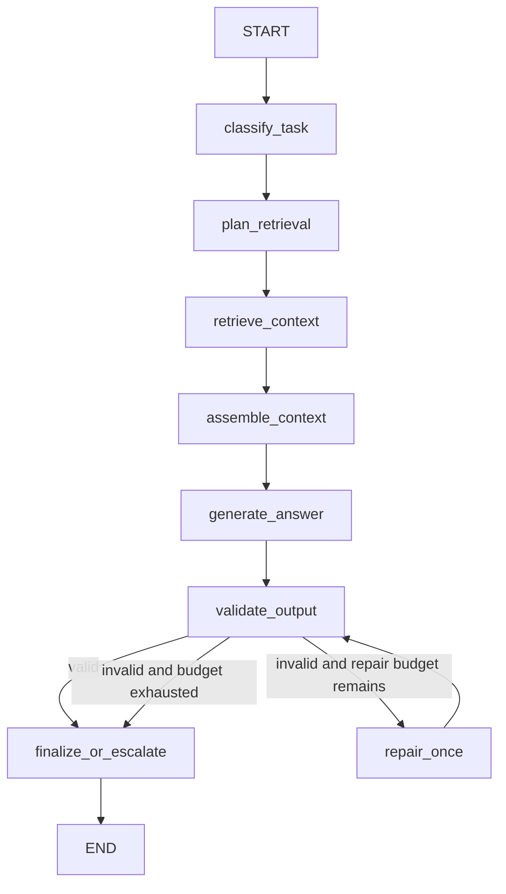

# LangGraph mm4 Bounded Agent

Status: implemented and live-smoke validated as of June 14, 2026.

## Purpose

`mm4_bounded_agentic` is an inference experiment, not a chatbot product. It
measures whether bounded orchestration improves grounded output enough to
justify additional model calls, prompt tokens, latency, validation, and
escalation handling.

The implementation uses LangGraph with an injected backend-neutral generator.
It can therefore run against a local or OpenAI-compatible model without giving
the graph internet, shell, or arbitrary tool access.

## Architecture

The retrieval node consumes the frozen promoted-context snapshot already stored
in the selected `mm2_hybrid_top5` workload record. It does not modify promoted
retrieval, issue internet requests, or consult gold evidence.

## State Schema

`AgentState` carries:

- prompt, workload, vertical, question, and task identity;
- task classification and risk level;
- retrieval plan, rounds, context, and selected evidence;
- generated output and strict validation result;
- repair, generation, and action-tool counters;
- final status and escalation reason;
- per-node latency, token usage, error type, and public trace events;
- backend/model identity and citation alias metadata.

Execution-only fields hold the frozen context pool, assembled prompt, repair
prompt, allowed short labels, and generation metrics. Pydantic validates the
state after every graph update and rejects any hard-limit violation.

## Nodes

| Node | Responsibility |
| --- | --- |
| `classify_task` | Derive a deterministic task risk level from the vertical and visible request. |
| `plan_retrieval` | Select the promoted hybrid top-five project-corpus strategy. |
| `retrieve_context` | Read at most five records from the frozen workload context snapshot. |
| `assemble_context` | Render stable `E1`-style evidence labels and the strict generation prompt. |
| `generate_answer` | Execute the first bounded model generation. |
| `validate_output` | Apply the unchanged contract parser plus allowed-label and local safety checks. |
| `repair_once` | Make one bounded correction request using the same evidence and labels. |
| `finalize_or_escalate` | Return answer, insufficient evidence, or escalation. |

Classification and planning are deterministic control nodes. Their prompts are
checked in as explicit future model-call contracts, but the A6 smoke does not
spend model calls on classification or planning.

## Approved Tools

Only these names are accepted:

- `retrieve_context`
- `assemble_context`
- `validate_generation_contract`
- `validate_evidence`
- `validate_safety`
- `repair_generation_once`
- `escalate`

The three-call action budget counts retrieval, context assembly, and the
optional repair. Deterministic validators and final escalation are local state
transitions and do not consume an external action call.

## Hard Limits

| Limit | Value |
| --- | ---: |
| Action-tool calls | 3 |
| Retrieval rounds | 2 |
| Generation attempts | 2 |
| Repair attempts | 1 |
| Internet access | Disabled |
| Arbitrary tools | Disabled |
| Corpus scope | Project corpus only |

The current graph normally uses one retrieval round. The second-round limit is
retained in the state and tool contract for future controlled experiments; it
is not an invitation to an unbounded retrieval loop.

## Prompts And Reasoning Boundary

Classifier, planner, generator, and repair prompts require:

- supplied project evidence only;
- strict five-field JSON;
- allowed evidence labels only;
- insufficient-evidence handling when support is absent;
- no hidden reasoning, planning notes, or chain-of-thought in output.

Trace events expose node names, status, tool names, and timings. They do not
store private reasoning.

## Finance Example Flow

Measured prompt `finance_scaleup_2000_0001`:

1. Classified as high risk.
2. Planned promoted hybrid top-five retrieval.
3. Retrieved one bounded round and assembled `E1` through `E5`.
4. Generated one answer in 779.335 ms with no repair.
5. Passed local contract, label, and safety validation.
6. Finalized as `answer`.

The offline evaluator later marked full evidence match and groundedness false.
This is an important boundary: the graph validates only supplied labels and
must not inspect evaluator-only gold IDs.

## Research AI Example Flow

Measured prompt `research_ai_scaleup_2000_0001`:

1. Classified as standard risk.
2. Planned promoted hybrid top-five retrieval.
3. Retrieved one round and selected `E1` and `E2`.
4. Generated one answer in 868.868 ms with no repair.
5. Passed local validation and the unchanged offline evaluator.
6. Finished with valid contract, full evidence match, groundedness, and no
   safety violation.

## Benchmark Value

mm4 is useful when a bounded validation/repair pass materially improves
contract adherence or evidence coverage and the request can tolerate extra
latency and tokens. It is especially relevant for structured, evidence-heavy
tasks where an invalid answer should be repaired once or escalated.

mm4 is too expensive or slow when:

- mm2/mm3 already meet quality targets;
- strict p95/p99 latency dominates;
- repair is frequent;
- token cost is the primary constraint;
- the underlying model is too weak to improve after one repair.

The A6 result keeps mm4 in the benchmark matrix, but it does not make mm4 the
default serving mode.
